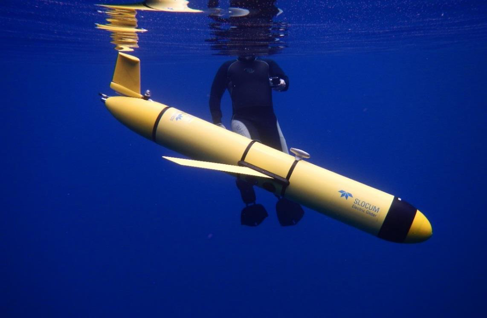
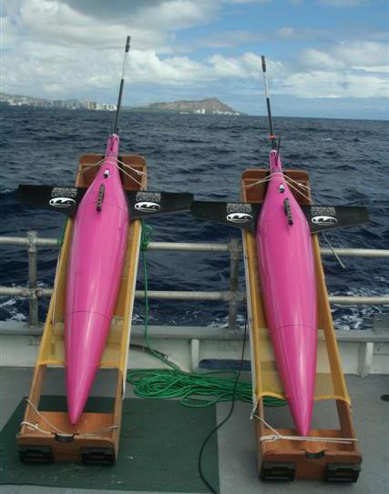
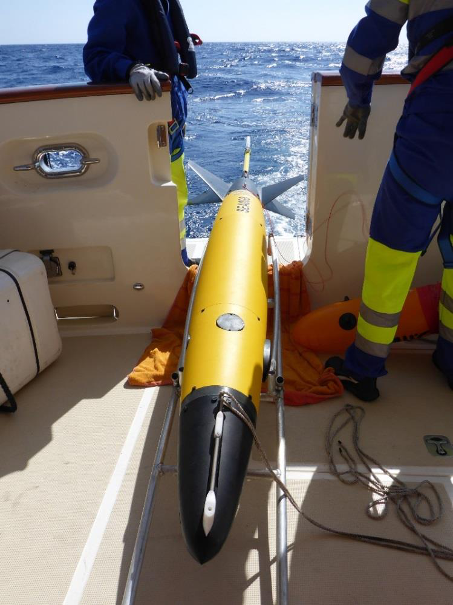
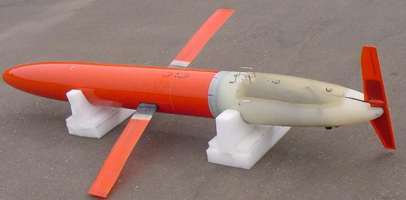

# Manual for Quality Control of Temperature and Salinity Data Observations from Gliders

<https://doi.org/10.25607/OBP-1465>

## Acknowledgements

We are grateful for the assistance of the Glider Data Assembly Center Temperature and Salinity Quality Control Manual Team,
which is listed in appendix A.

Special thanks to Dr. Matt Howard (Texas A&M University/Gulf of Mexico Coastal Ocean Observing System) for his efforts to initiate the development of this manual,
and to Dr. Dan Rudnick (Scripps Institution of Oceanography) for sharing his insights acquired through much glider QC experience.

We are grateful for the contributions and support provided by Stephanie Jaeger (SeaBird Electronics),
Dr. Fritz Stahr and Beth Curry (University of Washington), Danielle Bryant (Naval Oceanographic Office),
and Richard Davis and Brad Covey (Dalhousie University).
Also, we thank John Kerfoot and Laura Palamara (Rutgers University),
Ben Allsup (Teledyne-Webb),
and Chad Lembke and Frank Muller-Karger (University of South Florida) for their insight and comments.

## Acronyms and Abbreviations

| | |
|---|---|
|AUV|Autonomous Underwater Vehicle|
|CeNCOOS|Central and Northern California Ocean Observing System|
|CO-OPS|Center for Operational Oceanographic Products and Services|
|CT|Conductivity and Temperature|
|CTD|Conductivity, Temperature, and Depth|
|DAC|Data Assembly Center|
|EuroGOOS|European Global Ocean Observing System|
|GCOOS|Gulf of Mexico Coastal Ocean Observing System|
|GOOS|Global Ocean Observing System|
|GTSPP|Global Temperature and Salinity Profile Programme|
|IOOS|Integrated Ocean Observing System|
|LAGER|Local Automated Glider Editing Routine|
|MARACOOS|Mid-Atlantic Regional Association Coastal Ocean Observing System|
|PSS-78|Practical Salinity Scale - 1978|
|P|pressure|
|QARTOD|Quality Assurance/Quality Control of Real-Time Oceanographic Data|
|QA|Quality Assurance|
|QC|Quality Control|
|S|salinity (practical or absolute)|
|SCCOOS|Southern California Coastal Ocean Observing System|
|SD|standard deviation|
|SIO|Scripps Institution of Oceanography|
|SA|absolute salinity|
|SP|practical salinity|
|T|temperature|
|UWAPL|University of Washington Applied Physics Laboratory|

## Definitions of Selected Terms

|**Term**|**Definition**|
|---|---|
|**Absolute Salinity (SA)**|Absolute salinity is the mass fraction of salt in seawater, expressed in units of g/kg. Spatial variations of the composition of seawater mean that absolute<br>salinity is not simply proportional to practical salinity (TEOS-10).|
|**Codable Instructions**|Codable instructions are specific guidance that can be used by a software<br>programmer to design, construct, and implement a test. These instructions<br>also include examples with sample thresholds.|
|**Data Record**|A data record is one or more messages that form a coherent, logical, and<br>complete observation.|
|**Message**|A message is a standalone data transmission. A data record can be composed<br>of multiple messages.|
|**Operator**|Operators are individuals or entities who are responsible for collecting and<br>providing data.|
|**Practical Salinity (SP)**|Practical salinity is a unitless ratio expressing salinity as defined by the<br>Practical Salinity Scale 1978 (PSS-78).|
|**Quality Assurance (QA)**|QA involves processes that are employed with hardware to support the<br>generation of high quality data.|
|**Quality Control (QC)**|QC involves follow-on steps that support the delivery of high quality data<br>and requires both automation and human intervention.|
|**Real Time**|Real time means that: data are delivered without delay for immediate use;<br>time series extends only backwards in time, where the next data points are<br>not available; and there may be delays ranging from a few seconds to a few<br>hours or even days, depending upon the variable.|
|**Threshold**|Thresholds are limit of variables that are defined by the regional operator or<br>the Glider DAC.|
|**Variable**|Variable is an observation (or measurement) of biogeochemical properties<br>within oceanographic and/or meteorological environments.|

## Preface

The U.S. Integrated Ocean Observing System® (IOOS®) and its partners collect oceanographic data,
such as wave height and direction,
current velocity and direction,
temperature and salinity,
via both fixed and mobile platforms.
Real-time data collected from sensors attached to these platforms must be quality controlled before being published.

This manual describes the tests required to ensure the quality control (QC) of real-time data collected by sensors attached to profiling gliders.
Profiling gliders are self-propelled (buoyancy driven),
autonomous underwater vehicles (AUVs) that are deployed for days-tomonths and profile the water column collecting environmental data.
The _Constraints and Applications_ section describes the most frequently used gliders,
and has a partial list of the organizations that provide data to the U.S. IOOS Glider Data Assembly Center (DAC).
The _Quality Control_ section provides details about how the tests described in U.S. IOOS (2015) can be implemented.
Specifically, the tests in section 3.3.2 of that manual,
_Applications of QC Tests to Mobile Temperature/Salinity Sensors_,
are used as the starting point for this QC manual for real-time data collected from glider platforms.
The _Summary_ and _References_ sections provide an overview of the tests and full citations of references used in development of this manual.
Appendix A contains the names of the manual preparation team;
appendix B describes real-time temperature and salinity alignment challenges.
Appendix C and appendix D provide information about other QC programs and are used with permission from the Naval Oceanographic Office and the University of Washington School of Oceanography/Applied Physics Laboratory,
respectively.

The details of the U.S. IOOS glider program are not repeated herein;
however, the rationale for a glider network is well described in Baltes et al. (2014).
They also identify the gliders in use by those contributing to the U.S. IOOS Glider DAC.
The U.S. IOOS glider home page provides an overview of gliders, their applications,
a listing of various U.S. IOOS Regional Association deployments,
and related workshops/meetings (http://www.ioos.noaa.gov/glider/welcome.html).
A series of presentations from a strategy development workshop held on August 1-3, 2012 at the Scripps Institution of Oceanography (SIO) provides further details and background information.
Results from active and historical glider deployments can be viewed and links to data access can be found at http://dev.oceansmap.com/gliders/catalog/.

Glider QC points of contact are identified and posted on the emerging glider DAC website (http://gliders.ioos.us/index.html) so that the list can readily be maintained.

## Constraints and Applications

Mobile platforms are available in a variety of configurations and require different realtime QC considerations.
Mobile platforms are, in order of increasing complexity:
fixed vertical profilers,
mobile surface vessels,
and vessels freely operating in three dimensions (e.g., gliders, floats, powered AUVs).
This manual is primarily written for gliders.
Table 1 shows a representative list of these gliders and includes the institutions and types of instruments that provide data to the DAC; however,
it is not a comprehensive listing of all gliders.
Figures 1-4 illustrate examples of the glider models used to collect the data that this QC manual addresses.

At http://data.ioos.us/gliders/status (click on the **Latest** tab), a complete listing of the latest dataset updates can be found.
The page contains additional links to data and information about these data,
such as a summary map,
listings of operators and institutions,
the status of incomplete datasets, and a link to all datasets.

| Data Provider | Glider Type | Sensor |
| --- | --- | --- |
| Atlantic Oceanographic and Meteorological Laboratory | Seaglider | Sea-Bird Unpumped CT Sail (formerly SBE41) |
| Oregon State University | Seaglider | Sea-Bird Spray (Pumped) (formerly SBE 41CP) |
| Rutgers University | Slocum glider | Pumped Slocum Glider Payload CTD* (Slocum GPCTD) |
| Scripps Institute of Oceanography | Spray glider | Sea-Bird Pumped Spray glider CTD (formerly SBE41CP) |
| Texas A&M University Geochemical and Environmental Research Group | Slocum glider | Pumped Slocum Glider Payload (Slocum GPCTD) |

<small>_*Conductivity, Temperature, and Depth._</small>

: Table 1. Examples of Glider DAC information.



<figcaption>Figure 1. Slocum glider (photo courtesy of Rutgers University).</figcaption>



<figcaption>Figure 2. Seaglider (photo courtesy of the School of Ocean and Earth Science and Technology at the University of Hawaii at Manoa).</figcaption>



<figcaption>Figure 3. ALSEAMAR Sea Explorer (photo courtesy of Romain Tricarico/ALSEAMAR and Stephanie Jaeger/SeaBird Electronics).</figcaption>



<figcaption>Figure 4. Spray glider (photo courtesy of Dr. Fritz Stahr/UWAPL).</figcaption>

### Glider Temperature-Corrected Salinities

Gliders transiting gradients in temperature and salinity over short time scales may require additional QC.
Specifically, there are two corrections that should be applied prior to the real-time QC tests described in this manual:
a response time lag correction and a thermal lag correction.
However, the ability to make these two corrections in real time is a challenging and very contentious problem: the corrections are unique to each specific sensor and may require calibration factors.
The following discussion is an overview of the complexity associated with obtaining CTD data of high accuracy but is not meant to instruct or guide operators on these correction processes.
Further discussion of the various correction methods and their capabilities is included in appendix B.

**_Response Time Lag Correction_**.
Salinity is computed using nearly simultaneous measurements of temperature and conductivity made by two independent sensors.
Salinities computed using misaligned values will be incorrect and can appear as spikes in salinity data,
yielding erroneously unstable density profiles.
A misalignment can also occur if the temperature or conductivity sensors are located downstream of one another on the instrument or if the water flowing over the two sensors takes a different path,
such as through the plumbing of a pumped system.
This error can be corrected by slightly shifting the two records in time relative to each other.
The amount of shift depends on the sampling rate and the speed of the flow due to either the glider motion or a pump (Garau et al. 2011).

**_Thermal Lag Correction_**.
A second correction is needed to account for the thermal mass of the conductivity cell and its effect on the resulting salinity calculation.
Electrode conductivity sensors work by measuring the resistance across a small,
precise volume of water flowing through an open-ended cell.
When a conductivity sensor moves into cooler (or warmer) water,
the cell slightly warms (or cools) the water inside the cell.
Because conductivity is a strong function of temperature,
this small change in water temperature inside the cell leads to a significantly different conductivity measurement value than would have been made if the temperature inside the cell was the same as that outside the cell.
This thermal lag effect occurs whenever the glider passes through a temperature gradient.
Without corrections,
the paired conductivity and temperature used to calculate salinity will result in erroneous salinity and density values, especially across temperature gradients.
A method to correct for heating inside the cell has been developed, resulting in more accurate salinity profiles (Morison et al. 1994).
Garau et al. (2011)
specifically address the additional considerations associated with unpumped CTD sensors deployed on gliders.
Liu et al. (2015) examined the salinity corrections across a sharp thermocline with an unpumped CTD sensor and proposed further filtering along with the corrections.

Both types of corrections rely on previous values of temperature and a sufficiently high sampling rate.
The extent to which these corrections are applied in real time depends upon the capabilities of the CTD sensor,
the requirements of the operator,
and the resources available.

An advantage of pumped systems is that the flow rate through the cell is fixed and known.
For unpumped systems,
the flow rate through the cell can be variable,
depending on the angle and speed of the glider.
Corrections are more effectively accomplished during post-processing of the full resolution profiles than in real time,
where many people believe an insufficient amount of data is transmitted.
The metadata should indicate if the real-time profiles have been corrected by the operator before submission to the DAC.

## Quality Control

To conduct real-time QC on glider observations,
the first prerequisite is to understand the science and context within which the measurements are being conducted.
Glider deployments have a unique definition of ‘real time’,
providing space-time profiles of a variety of variables upon surfacing.
While each sensor provides vastly different products, QC techniques can be applied broadly.
In this initial U.S. IOOS Glider DAC QC manual,
we focus on the observations of temperature (T),
conductivity (C),
and on the calculation of salinity (S),
collectively referred to herein as TS observations.
The decision to use either Practical Salinity (S<sub>P</sub>) or Absolute Salinity (S<sub>A</sub>) is left to the operator.

TS measurements can be used to resolve many things,
such as internal waves,
oceanic fronts,
river runoff,
upwelling, etc.,
and some of these can be extreme events.
Human involvement is therefore important to ensure that good data are not discarded and bad data are not distributed by using scientific principles applied to data evaluation.

The real-time QC of TS observations taken from sensors attached to gliders can be extremely challenging.
For example,
gradual calibration changes and long-term system responses,
such as sensor drift,
most likely cannot be detected or corrected with realtime, automated QC.
Drift correction for TS measurements during post-processing is difficult even if a valid post-recovery calibration is obtained.
Drift is often caused by biofouling,
affecting different systems in different ways—a sensor’s response will be affected by the added mass of bio-fouling.
Another example is the ability of some data providers to backfill data gaps quickly.
In both of these examples,
the observations cannot be corrected in real time.

### QC Flags

Data are evaluated using QC tests,
and the results of those tests are recorded by inserting flags in the data record.
Table 2 provides the simple set of flags and associated descriptions adopted by U.S. IOOS and employed at the Glider DAC.
Operators may incorporate additional flags for inclusion in metadata records to further assist with troubleshooting.
For example,
an observation may fail the temperature min/max range test and be flagged as having failed.
An operator could provide an additional test to further define a failure:
if the data failed the temperature min/max by exceeding the upper limit,
a “failed high” flag could indicate that the values were higher than the expected range.
Such detailed flags primarily support maintenance efforts and are presently beyond U.S. IOOS Glider DAC requirements for QC of real-time data.
For additional information regarding flags,
see the _Manual for the Use of Real-Time Oceanographic Data Quality Control Flags_ (U.S.IOOS 2014) posted on the U.S. IOOS QARTOD website.

Post-processing of the data may yield improvements to data that were initially disseminated.
Flags set in real time should not be changed to ensure that historical documentation is preserved.
Results from post-processing should generate another set of flags.

Observations are time-ordered,
and the most recent observation is n₀,
preceded by a value at n₋₁,
and so on moving back in time.
The focus is primarily on the real-time QC of observations n₀, n₋₁, and n₋₂.

|**Flag**|**Description**|
|---|---|
|Pass=1|Data have passed critical real-time quality control tests and are deemed<br>adequate for use as preliminary data.|
|Not evaluated=2|Data have not been QC-tested, or the information on quality is not<br>available.|
|Suspect or<br>Of High Interest=3|Data are considered to be either suspect or of high interest to data<br>providers and users. They are flagged suspect to draw further attention<br>to them by operators.|
|Fail=4|Data are considered to have failed one or more critical real-time QC<br>checks. If they are disseminated at all, it should be readily apparent that<br>they are not of acceptable quality.|
|Missing data=9|Data are missing; used as a placeholder.|

: Table 2. Flags for real-time data (UNESCO 2013).

### Test Hierarchy

This section outlines the 14 real-time QC tests that are required, strongly recommended, or suggested for real-time TS measurements. Salinity may be computed onboard the sensor package or after transmission of the raw data. When possible, tests should be applied to conductivity and temperature observations, as well as the derived salinity values, regardless of where the salinity calculation takes place. Operators should also consider that some of these tests can be carried out within the instrument, where thresholds can be defined in configuration files. Although more tests may imply a more robust QC effort, there are many reasons operators could use to justify not conducting some tests. In those cases, operators need only to document reasons these tests do not apply to their observations. Tests in table 3 are divided into three groups: those that are required, strongly recommended, or suggested.

| Group | Test | Name |
|---|---|---|
|**Group 1**<br>_Required_|Test 1)<br>Test 2)<br>Test 3)<br>Test 4)<br>Test 5)|Timing/Gap Test<br>Syntax Test<br>Location Test<br>Gross Range Test<br>Pressure Test|
|**Group 2**<br>_Strongly_<br>_Recommended_|Test 6)<br>Test 7)<br>Test 8)<br>Test 9)|Climatological Test<br>Spike Test<br>Rate of Change Test<br>Flat Line Test|
|**Group 3**<br>_Suggested_|Test 10)<br>Test 11)<br>Test 12)<br>Test 13)<br>Test 14)|Multi-Variate Test<br>Attenuated Signal Test<br>Previous Profile Test<br>TS Curve/Space Test<br>Density Inversion Test|

: Table 3. Test Hierarchy.

### Test Description

A variety of tests can be performed to evaluate data quality in real time. 
Testing the timely arrival and integrity of the data transmission itself is a first step. 
If the data are corrupted during transmission, 
further testing may be irrelevant. 
The checks defined in these 14 tests evaluate data through various comparisons to other data and to the expected conditions in the given environment. 
The tests listed in this section presume a time-ordered series of observations and denote the most recent observation as previously described.

Sensor operators need to select the best thresholds for each test, 
which are determined at the operator level and may require trial and error before final selections are made. 
A successful QC effort is highly dependent upon selection of the proper thresholds, 
which should not be determined arbitrarily but can be based on historical knowledge or statistics derived from more recently acquired data. 
Although this manual provides some guidance for selecting thresholds based on input from various operators, 
it is assumed that operators have the expertise and motivation to select the proper thresholds to maximize the value of their QC effort. 
Operators must openly provide thresholds as metadata for user support. 
This shared information will help U.S. IOOS to document standardized thresholds that will be included in future releases of this manual.

Several existing programs have developed QC tests that are similar to the U.S. IOOS Glider DAC QC tests in this manual, 
including: 1) the U.S. Navy’s Local Automated Glider Editing Routine (LAGER) Automated Processing and QC, 2) University of Washington Seaglider Quality Control Manual, 3) the Global Temperature and Salinity Profile Programme (GTSPP) and 4) the Argo program. 
Manuals from the GTSPP and Argo programs are available online (UNESCO-IOC 2010; Carval et al. 2015). 
Section 6 of the LAGER manual is attached as appendix C, 
and the full University of Washington Applied Physics Laboratory (UWAPL) Seaglider Quality Control Manual is attached as appendix D. 
Similar glider QC efforts are evolving in related activities in Europe, 
such as Everyone's Gliding Observatories (http://www.ego-network.org/dokuwiki/doku.php), 
the Coriolis Data Assembly Centre (http://www.coriolis.eu.org/Observing-the-Ocean/GLIDERS), 
and Gliders for Research, 
Ocean Observations, 
and Management (http://www.groom-fp7.eu/doku.php). 
Operators within these and similar programs will likely find their present QC process to be largely compliant with U.S. IOOS Glider DAC requirements and recommendations, 
which is the intention of the Glider DAC TS QC committee. 
Table 4 provides a comparison of QC tests from this U.S. IOOS Glider DAC QC manual, 
LAGER, 
GTSPP, 
real-time Argo, 
and UWAPL programs. 
UWAPL tests are not numerically identified, 
so only an indication that a matching test is conducted can be provided.

Each data point is quality controlled and assigned a flag using these tests. 
Operators may choose to expand upon the flagging scheme using another tier of flags, e.g., 
to characterize the entire vertical profile.

|**Glider DAC**|**LAGER**|**GTSPP**|**Argo**|**UWAPL**|
|---|---|---|---|---|
|1)  Timing/Gap Test|No match|1.2|2|No match|
|2)  Syntax Test|No match|No match|1 (close, not<br>identical)|No match|
|3)  Location Test|6.1|1.3, 1.4|3, 4, 5|Yes|
|4)  Gross Range Test|6.3.2.1, 6.3.4.1,<br>6.3.5.1, 6.5.2|2.1|6, 7|Yes|
|5)  Pressure Test|6.2|2.4|8|No match|
|6) Climatological Test|6.5.3|3.1, 3.2, 3.3,<br>3.4|No match|No match|
|7)  Spike Test|6.3.2.4, 6.3.3.1,<br>6.3.4.3, 6.3.5.3,<br>6.5.5|2.7, 2.8|9|Yes|
|8)   Rate of Change Test|6.3.2.5, 6.3.4.4|2.9, 4.1|11|No match|
|9)  Flat Line Test|6.3.2.3, 6.5.4|2.4, 2.5|14, 18|No match|
|10)  Multi-Variate Test|No match|No match|No match|No match|
|11)  Attenuated  Signal Test|No match|2.4|16 (close,<br>not<br>identical)|No match|
|12)  Previous Profile Test|No match|No match|No match|No match|
|13)  TS Curve/Space Test|No match|No match|No match|No match|
|14)  Density Inversion Test|6.6.2|2.10|14|No match|

: Table 4. Comparison of U.S. IOOS Glider DAC, LAGER, GTSPP, Argo QC, and UWAPL tests. LAGER, GTSPP and Argo test numbers are matched to similar QARTOD tests.

**Test 1 - Timing/Gap Test (Required)**

Check for arrival of data.
Test determines that the most recent profile has been received within the expected time window (`TIM_INC`) and has the correct time stamp (`TIM_STMP`).
**Note:** For those gliders that do not update at regular intervals, a large value for TIM_STMP can be assigned. 
The gap check is not a solution for all timing errors. 
Data could be measured or received earlier than expected. 
This test does not address all clock drift/jump issues.

| Flags | Condition | Codable Instructions |
|---|---|---|
|Fail=4|Data have not arrived as<br>expected.|If `NOW` – `TIM_STMP` > `TIM_INC`, flag = 4|
|Suspect=3|N/A|N/A|
|Pass=1|Applies for test pass condition.|N/A|

Test Exception: None.

Test specifications to be established locally by the operator.

Example: `TIM_INC` = 6 hours

**Test 2 - Syntax Test (Required)**

Check to ensure that the message is structured properly. 
Received data message (full message) contains the proper structure without any indicators of flawed transmission such as parity errors. 
Possible tests are: a) the expected number of characters (`NCHAR`) for fixed length messages equals the number of characters received (`REC_CHAR`), 
or b) passes a standard parity bit check, 
cyclic redundancy check (CRC), etc. 
Many such syntax tests exist, 
and the user should select the best criteria for one or more syntax tests.

Capabilities for dealing with flawed messages vary among operators; 
some may have the ability to parse messages to extract data within the flawed message sentence before the flaw. 
A syntax check is performed only at the message level and not within the message content. 
In cases where a data record requires multiple messages, 
this check can be performed at the message level but is not used to check message content.

| Flags | Condition | Codable Instructions |
| --- | --- | --- |
| Fail=4 | Data sentence cannot be parsed to provide a valid observation. | If REC_CHAR ≠ NCHAR, flag = 4 |
| Suspect=3 | N/A | N/A |
| Pass=1 | Expected data sentence received; absence of parity errors. | N/A |

Test Exception: None.

Test specifications: To be established locally by the operator.

Examples: NCHAR = 128

**Test 3 - Location Test (Required)**

Check for reasonable geographic location.
Test checks that the reported present physical location (latitude/longitude) is within operatordetermined limits. 
The location test(s) can vary from a simple impossible location to a more complex check for displacement (`DISP`) exceeding a distance limit (`RANGEMAX`) based upon a previous location and platform speed. 
Operators may also check for erroneous locations based upon other criteria, 
such as reported positions over land, as appropriate. 
**Note:** Some operators linearly interpolate between surface GPS positions to derive positions during downglides and upglides. This Location Test addresses only the observed GPS surface positions.

| Flags | Condition | Codable Instructions |
|---|---|---|
| --- | --- | --- |
| Fail=4 | Impossible location. | LAT > \|90\| or LONG > \|180\|, flag = 4 |
| Suspect=3 | Unlikely platform displacement. | `DISP` > `RANGEMAX`, flag = 3 |
| Pass=1 | Applies for test pass condition. | N/A |

Test Exception: None.

Test specifications: To be established locally by the operator.

Examples: Displacement DISP calculated between sequential position reports, `RANGEMAX` = 20 km.

**Test 4 - Gross Range Test (Required)**

Data point exceeds sensor or operator-selected min/max. Applies to T, S, C and P (pressure).
All sensors have a limited output range, 
and this can form the most rudimentary gross range check. 
No values less than a minimum value or greater than the maximum value the sensor can output (`T_SENSOR_MIN`, `T_SENSOR_MAX`) are acceptable. 
Additionally, the operator can select a smaller span (T_USER_MIN, T_USER_MAX) based upon local knowledge or a desire to draw attention to extreme values.
**Note:** Operators may choose to flag as suspect values that exceed the calibration span but not the hardware limits (e.g., a value that sensor is not capable of producing or negative conductivity).

| Flags | Condition | Codable Instructions |
|---|---|---|
| Fail=4 | Reported value is outside of sensor span. | If Tₙ < T_SENSOR_MIN, or Tₙ > T_SENSOR_MAX, flag = 4 |
| Suspect=3 | Reported value is outside of user-selected span. | If Tₙ < T_USER_MIN, or Tₙ > T_USER_MAX, flag = 3 |
| Pass=1 | Applies for test pass condition. | N/A |

Test Exception: None.

Test specifications to be established locally by the operator.

Examples: Operators to provide sensor and user min/max examples.

**Test 5 - Pressure Test (Required)**

Check for monotonically ordered pressure record.
Test inspects the downglide (upglide) to ensure a continuously increasing (decreasing) pressure series. 
In this test example a downglide pressure series is examined for a continuously increasing pressure. 
Pressure (Pₙ) is routinely expected to be larger than Pₙ₋₁. Reasons for rare exceptions to this expectation may be found in Merckelbach et al. (2010) and elsewhere.

Note: The test flags a neutrally buoyant glider record as suspect or of high interest.

| Flags | Condition | Codable Instructions |
| --- | --- | --- |
| Fail=4 | No fail flag is identified for this test. | N/A |
| Suspect=3 | Pressure does not monotonically increase with depth. | If Pₙ ≤ Pₙ₋₁, flag = 3 |
| Pass=1 | Applies for test pass condition. | N/A |

Test Exception: None.

Test specifications: To be established locally by the operator.

Examples: None.

**Test 6 - Climatology Test (Strongly Recommended)**

Test that data point falls within seasonal expectations. Applies to T and S.

This test is a variation on the gross range check, 
where the gross range `T_Season_MAX` and `T_Season_MIN` are adjusted monthly, seasonally, 
or at some other operator-selected time period (`TIM_TST`). Expertise of the local operator is required to determine reasonable seasonal averages. 
Longer time series permit more refined identification of appropriate thresholds. 
The ranges should also vary with water depth, if the measurements are taken at sites that cover significant vertical extent and if climatological ranges are meaningfully different at different depths (e.g., narrower ranges at greater depth). 
Climatology databases such as the temperature Variability Generalized Digital Environmental Model (Allen et al. 2012) or the National Centers for Environmental Information World Ocean Database (Boyer et al. 2013) may be used for climatological guidance.

| Flags | Condition | Codable Instructions |
| --- | --- | --- |
| Fail=4 | Because of the dynamic nature of T and S in some locations, no fail flag is identified for this test. | N/A |
| Suspect=3 | Reported value is outside of operator-identified climatology window. | If Tₙ < T_Season_MIN or Tₙ > T_Season_MAX, flag = 3 |
| Pass=1 | Applies for test pass condition. | N/A |

Test Exception: None.

Test specifications: To be established locally by operator: a seasonal matrix of Tmax and Tmin values at all `TIM_TST` intervals.

Examples: `T_SPRING_MIN` = 12 °C, `T_SPRING_MAX` = 18.0 °C

**Test 7 - Spike Test (Strongly Recommended)**

Data point n-1 exceeds a selected threshold relative to adjacent data points. Applies to T, S, C, and P.
This check is for single value spikes, specifically the value at point n-1. Spikes consisting of more than one data point are difficult to capture, 
but their onset may be flagged by the rate of change test. 
The spike test consists of two operator-selected thresholds, THRSHLD_LOW and THRSHLD_HIGH. 
Adjacent data points (n₋₂ and n₀) are averaged to form a spike reference (SPK_REF). 
The absolute value of the spike is tested to capture positive and negative spikes. Large spikes are easier to identify as outliers and flag as failures. 
Smaller spikes may be real and are only flagged suspect. 
The thresholds may be fixed values or dynamically established (for example, a multiple of the standard deviation over an operator-selected depth range). 
Unpumped sensors transiting thermal gradients are perhaps the most common source of spikes in salinity.

| Flags | Condition | Codable Instructions |
| --- | --- | --- |
| Fail=4 | High spike threshold exceeded. | If \|Sₙ₋₁ - `SPK_REF`\| > `THRSHLD_HIGH`, flag = 4 |
| Suspect=3 | Low spike threshold exceeded. | If \|Sₙ₋₁ - SPK_REF\| > `THRSHLD_LOW` and \|Sₙ₋₁ - `SPK_REF`\| ≤ `THRSHLD_HIGH`, flag = 3 |
| Pass=1 | Applies for test pass condition. | N/A |

Test Exception: None.

Test specifications: To be established locally by the operator.

Examples: `THRSHLD_LOW` = 0.02, `THRSHLD_HIGH` = 0.05

**Test 8 - Rate of Change Test (Strongly Recommended)**

Excessive rise/fall test. Applies to T, S, C, and P.
This test inspects the time series for a time rate of change that exceeds a threshold value identified by the operator. 
T, C, and S values can change substantially over small depth ranges in some locations, hindering the value of this test. 
A balance must be found between a threshold set too low, 
which triggers too many false alarms, and one set too high, 
making the test ineffective. 
Determining the excessive rate of change is left to the local operator. 
The following show three different examples of ways to select the thresholds provided by QARTOD VI participants. 
Implementation of this test can be challenging. 
Upon failure, 
it is unknown which of the points is bad. 
Further, 
upon failing a data point, it remains to be determined how the next iteration can be handled.

- The rate of change between temperature Tₙ₋₁ and Tₙ must be less than an operator-defined multiple of the local standard deviation (SD). The local operator determines both the number of SDs (`N_DEV`) and the depth sample interval over which the SDs (`ZRANGE_DEV`) are calculated.
- The rate of change between temperature Tₙ₋₁ and Tₙ must be less than 2 °C + 2SD.
- |Tₙ₋₁ - Tₙ₋₂| + |Tₙ₋₁ - Tₙ| ≤ 2*N_DEV*SD (example provided by EuroGOOS).

| Flags | Condition | Codable Instructions |
| --- | --- | --- |
| Fail=4 | No fail flag is identified for this test. | N/A |
| Suspect=3 | The rate of change exceeds the selected threshold. | If \|Tₙ - Tₙ₋₁\| > N_DEV*SD, flag = 3 |
| Pass=1 | Applies for test pass condition. | N/A |

Test Exception: None.

Test specifications: To be established locally by operator.

Examples: `N_DEV` = 3, `ZRANGE_DEV` = 25 meters

**Test 9 - Flat Line Test (Strongly Recommended)**

Invariant value. Applies to T, S, C, and P.
When some sensors and/or data collection platforms fail, 
the result can be a continuously repeated observation of the same value. 
This test compares the present observation (_n_) to a number (`REP_CNT_FAIL` or `REP_CNT_SUSPECT`) of previous observations. 
Observation (_n_) is flagged if it has the same value as previous observations within a tolerance value, `EPS`, 
to allow for numerical round-off error. Note that historical flags are not changed.

Uniformly mixed surface layers and deep waters may approach flat line conditions, 
while still being valid observations. 
Judicious selection of the three described thresholds by knowledgeable operators is needed to minimize false fail or suspect flags.

| Flags | Condition | Codable Instructions |
| --- | --- | --- |
| Fail=4 | When many of the most recent observations are equal, Tₙ is flagged fail. | For i=1, `REP_CNT_FAIL`: Tₙ - Tₙ₋ᵢ < `EPS`, flag = 4 |
| Suspect=3 | It is possible but unlikely that the present observation and the multiple previous observations would be equal. When the most recent observations are equal, Tₙ is flagged suspect. | For i=1, `REP_CNT_SUSPECT`: Tₙ - Tₙ₋ᵢ < EPS, flag = 3 |
| Pass=1 | Applies for test pass condition. | N/A |

Test Exception: None.

Test specifications: To be established locally by the operator.

Examples: `REP_CNT_FAIL` = 20, `REP_CNT_SUSPECT` = 10, `EPS` = 0.005°

**Test 10 - Multi-Variate Test (Suggested)**

Comparison to other variables. Applies to T, C, S, and P.
This is an advanced family of tests, 
starting with the simpler test described here and anticipating growth towards full co-variance testing in the future. 
It is doubtful that anyone is conducting tests such as these in real time. 
As these tests are developed and implemented, 
they should be documented and standardized in later versions of this manual.

This example pairs rate of change tests as described in test 8. 
The T (or S or P) rate of change test is conducted with a more restrictive threshold (`N_T_DEV`). 
If this test fails, 
a second rate of change test operating on a second variable (conductivity or salinity would be the most probable) is conducted. 
The absolute value rate of change should be tested, 
since the relationship between T and variable two is indeterminate. 
If the rate of change test on the second variable fails to exceed a threshold (e.g., an anomalous step is found in temperature and is lacking in salinity), then the Tₙ value is flagged.
Note that Test 13, TS Curve/Space Test is a well-known example of the multi-variate test.

| Flags | Condition | Codable Instructions |
| --- | --- | --- |
| Fail=4 | No fail flag is identified for this test. | N/A |
| Suspect=3 | Tₙ fails the rate of change and the second variable does not exceed the rate of change. | If \|Tₙ - Tₙ₋₁\| > N_T_DEV*SD_T AND \|Sₙ - Sₙ₋₁\| < N_S_DEV*SD_S, flag = 3 |
| Pass=1 | N/A | N/A |

Test Exception: None.

Test specifications: To be established locally by the operator.

Examples: `N_T_DEV` = 2, `N_TEMP_DEV` = 2, `ZRANGE_DEV` = 25 meters

In a more complex case, more than one secondary rate of change test can be conducted. 
Temperature, salinity, turbidity, 
nutrients, and chlorophyll are all possible secondary candidates, 
and all could be checked for anomalous rate of change values. 
In this case, 
a knowledgeable operator may elect to pass flag a high rate of change observation when any one of the secondary variables also exhibits a high rate of change. 
Such tests border on modeling, should be carefully considered, 
and may be beyond the scope of this effort.

The Glider DAC TS QC committee recognized the high value in full co-variance testing but also noted the challenges. 
Therefore full co-variance QC tests are still considered experimental.

**Test 11 - Attenuated Signal Test (Suggested)**

A test for inadequate variation of the time series. Applies to T, S, C, and P. A common sensor failure mode can provide a data series that is nearly but not exactly a flat line (e.g., if the conductivity cell was to become clogged). This test inspects for a standard deviation (SD) value or a range variation (MAX-MIN) value that fails to exceed threshold values (MIN_VAR_WARN, MIN_VAR_FAIL) over a selected depth range (TST_ZRANGE).

|**Flags **|**Condition**|**Codable Instructions**|
|---|---|---|
|Fail=4|Variation fails to meet the<br>minimum threshold<br>MIN_VAR_FAIL.|If throughout TST_ZRANGE, SD<br><MIN_VAR_FAIL, or<br>During TST_ZRANGE, MAX-MIN<br><MIN_VAR_FAIL,flag= 4|
|Suspect=3|Variation fails to meet the<br>minimum threshold<br>MIN_VAR_WARN.|If throughout TST_ZRANGE, SD<br><MIN_VAR_WARN, or<br>During TST_ZRANGE, MAX-MIN<br><MIN_VAR_WARN,flag= 3|
|Pass=1|Applies for test pass condition.|N/A|
|**Test Excepti**|**on:**None.||
|**Test specific**<br>**Examples:**|**ations to be established locally by the op**<br>TST_ZRANGE =  50 meters<br>MIN_VAR_WARN=0.05 °C, MIN_VAR_F|**erator.**<br>AIL=0.01 °C|

###### Test 12) Previous Profile Test (Suggested)

###### Comparison to nearby profiles. Applies to T, C, S.

The previous ( _n-1_ ) downglide or upglide can often serve as a good reference for the new ( _n_ ) downglide or upglide. The example below illustrates a temperature comparison.

At each pressure (P) in a profile, the absolute difference between the new observation (T _n,P_ ) and the previous observation (T _n-1,P_ ) is determined and compared to an operator-selected threshold. The selected thresholds are a function of pressure to allow greater variability in the vicinity of the thermocline/halocline and lesser variability at depth.

The utility of this test depends largely upon the glider mission. For studies of small variations in the ocean interior, it could quickly identify hardware issues, but when tracking oceanic fronts, the test would likely be disabled.

|**Flags**|**Condition**|**Codable Instructions**|
|---|---|---|
|Fail=4|Because of the dynamic nature<br>of T and S in some locations, no<br>fail flag is identified for this test.|N/A|
|Suspect=3|Reported value is outside of<br>operator-identified deviation<br>from previous profile.|If |T_n,P_ - T_n-1,P_ |> TDEVP, flag = 3|
|Pass=1|Applies for test pass condition.|N/A|
|**Test Exceptio**<br>be conducted|**n:**May be disabled for glider missions<br>on the first glide.|seeking large horizontal gradients. Test cannot|
|**Test specifica**<br>deviation fro<br>**Examples:**0-|**tions to be established locally by the**<br>m the previous profile.<br>15 dbar, TDEV=0.5 °C; 15-40 dbar, TDE|**operator.**Profiles of acceptable T, C, and S<br>V=1.0 °C; 40-200 dbar TDEV=0.1 °C|


~~18~~

###### Test 13) TS Curve/Space Test (Suggested)

###### Comparison to expected TS relationship. Applies to T, S.

The TS curve is a classic tool used to evaluate observations, especially in the open ocean below the thermocline. Site-specific TS curve characteristics are used to identify outliers. The curve could be either a fitted equation or numerical table. For a given T _n_ , S _n_ is expected to be within Sfit ± S_fit_warn or S_fit_fail, operator-provided values. The value Sfit is obtained from the equation or table.

|**Flags **|**Condition**|**Codable Instructions**|
|---|---|---|
|Fail=4|For a given temperature, the<br>observed salinity falls outside the<br>TS curve failure threshold.|If |S_n_-Sfit| >S_fit_fail, flag = 4|
|Suspect=3|For a given temperature, the<br>observed salinity falls outside the<br>TS curve warning threshold.|If |S_n_-Sfit| <S_fit_fail and |S_n_-Sfit| ≥S_fit_warn,<br>flag = 3|
|Pass=1|For a given temperature, the<br>observed salinity falls within the<br>specified TS curve threshold.||S_n_-Sfit| <S_fit_warn, flag = 1|
|**Test Excepti**|**on:**The test will probably not be usef|ul above the thermocline.|
|**Test specific**<br>**Examples:**|**ations to be established locally by th**<br>At the Bermuda Atlantic Time Serie<br>salinitySfit = 36.5, S_fit_fail = 0.05,|**e operator.**<br>s site, for a temperature of 18°C, practical<br>S_fit_warn = 0.02|


~~19~~

###### Test 14) Density Inversion Test (Suggested)

###### Checks that density increases with pressure (depth).

With few exceptions, potential water density (σθ) will increase with increasing pressure. When vertical profile data are obtained, this test is used to flag failed T, C, and S observations, which yield densities that do not sufficiently increase with pressure. A small operator-selected density threshold (DT) allows for micro-turbulent exceptions. Here, σθ _n_ is defined as one sample increment deeper than σθ _n_ -1. With proper consideration, the test can be run on downglides, upglides, or down/upglide results produced in real time.

From a computational point of view, this test is similar to the rate of change test (test 8). The same code can be used for both, using different variables and thresholds. As with the rate of change test, it is not known which side of the step is good versus bad.

An example of the software to compute sigma-theta (σθ) is available at http://www.teos- <u>10.org/software.htm. Operators may choose a different measure of density, such as σt.</u>

|**Flags **|**Condition**|**Codable Instructions**|
|---|---|---|
|Fail=4|Potential density does not<br>sufficiently increase with<br>increasingdepth.|If σθ_n_-1+DT > σθ_n_, flag = 4|
|Suspect=3|No suspect flag is identified for<br>this test.|N/A|
|Pass=1|Potential density sufficiently<br>increases with increasingdepth.|If σθ_n_-1+DT ≤ σθ_n_, flag = 1|
|**Test Excepti**|**on:**None.||
|**Test specific**<br>**Examples:**|**ations to be established locally by the**<br>DT = 0.03 kg/m<sup>3</sup>|**operator.**|


~~20~~

# Summary

The QC tests in this glider document have been compiled using the guidance provided by the volunteer committee and valuable reviewers (appendix A). Test suggestions came from both operators and TS profile data users with extensive experience. The considerations of operators who ensure the quality of real-time data may be different from those whose data are not published in real time, and these and other differences must be balanced according to the specific circumstances of each operator. Although these real-time tests are required, strongly recommended, or suggested, it is the operator who is responsible for deciding which tests are appropriate. Each operator selects thresholds based on the specific program requirements that must be met. The scope of requirements can vary widely, from complex data streams that support myriad QC checks to ensure precise and accurate measurements to basic data streams that do not need such details. Operators must publish their QC processes via metadata so that data users can readily see and understand the source and quality of those data.

The 14 QC tests identified in this manual apply to TS profile observations from a variety of gliders and operators who are providing data to the U.S. IOOS Glider DAC. The individual tests are described and include codable instructions, output conditions, example thresholds, and exceptions (if any). Several existing programs, including the U.S. Navy’s LAGER Automated Processing and QC (appendix C), the UWAPL’s Seaglider Quality Control Manual (appendix D), GTSPP (UNESCO-IOC 2010) and Argo (Carval et al. 2015), have developed QC tests for mobile platforms that are similar to the U.S. IOOS glider QC tests in this manual.

Selection of the proper thresholds is critical to a successful QC effort. Thresholds can be based on historical knowledge or statistics derived from more recently acquired data, but they should not be determined arbitrarily. This manual provides guidance for selecting thresholds based on input from various operators, but also notes that operators need the subject matter expertise and motivation to select the proper thresholds to maximize the value of their QC effort.

The test procedures in this manual address only real-time, in-situ observations. The tests do not include post-processing, which is not in real time but may be useful for ecosystembased management, or delayed-mode, which might be suitable for climate studies.

This manual is envisioned as a dynamic document and will be posted on the U.S. IOOS Glider DAC website at www.ioos.noaa.gov/glider. This process allows for QC manual updates as technology development occurs for both upgrades of existing sensors and new sensors.

~~21~~

# References

- Allen, R. L. Jr. and US Navy; Naval Oceanographic Office (2012). Global gridded physical profile data from the U.S. Navy's Generalized Digital Environmental Model (GDEM) product database (NODC Accession 9600094). Version 1.1. National Oceanographic Data Center, NOAA. Dataset.

- Baltes, B., D. Rudnick, M. Crowley, O. Schofield, C. Lee, J. Barth, C. Lembke…J. Potemra, (2014). Toward a U.S. IOOS<sup>®</sup> Underwater Glider Network Plan: Part of a comprehensive subsurface observing system.

   - <u>http://www.ioos.noaa.gov/glider/strategy/glider_network_whitepaper_final.pdf</u>

- Boyer, T.P., J. I. Antonov, O. K. Baranova, C. Coleman, H. E. Garcia, A. Grodsky, D. R. Johnson, R. A. Locarnini, A. V. Mishonov, T.D. O'Brien, C.R. Paver, J.R. Reagan, D. Seidov, I. V. Smolyar, and M. M. Zweng (2013): World Ocean Database 2013, NOAA Atlas NESDIS 72, S. Levitus, Ed., A. Mishonov, Technical Ed.; Silver Spring, MD, 209 pp., <u>http://doi.org/10.7289/V5NZ85MT</u>

- Carval, T., R. Keeley, Y. Takatsuki, T. Yoshida, C. Schmid, R. Goldsmith, A. Wong, A. Thresher, A. Tran, S. Loch, R. Mccreadie (2015). Argo user’s manual V3.2. <u>http://dx.doi.org/10.13155/29825</u>

- Garau, B., S. Ruiz, W. Zhang, A. Pasucal, E. Heslop, J. Kerfoot, and J. Tintore, 2011. Thermal lag correction on Slocum CTD glider data _. J. Atmos. Ocean. Technol_ ., 28(9), 1065–1071.

- GTSPP Real-Time Quality Control Manual, First Revised Edition. UNESCO-IOC 2010. (IOC Manuals and Guides No. 22, Revised Edition.) (IOC/2010/MG/22Rev.)

   - Note: The initial version of the manual was published in 1990 (SC-90/WS-74) Published in 2010 by the United Nations Educational, Scientific and Cultural Organization, 7, Place de Fontenoy, 75352, Paris 07 SP UNESCO 2010 <u>http://www.nodc.noaa.gov/GTSPP/document/qcmans/MG22rev1.pdf</u>

- Liu, Y., R.H. Weisberg, and C. Lembke (2015). Glider salinity correction for unpumped CTD sensors across a sharp thermocline, in _Coastal Ocean Observing Systems_ , 305325, Elsevier (Academic Press), http://dx.doi.org/10.1016/B978-0-12-802022- <u>7.00017-1.</u>

- Merckelbach, L., D. Smeed and G. Griffiths (2010). Vertical water velocities from underwater gliders. _Journal of Atmospheric and Oceanic Technology_ , 27, (3), 547563. (doi:10.1175/2009JTECHO710.1).

- Morison, J., R. Andersen, N. Larson, E. D'Asaro, and T. Boyd. (1994). The correction for thermal-lag effects in Sea-Bird CTD data. _J. Atmos. Ocean. Technol_ ., 11, 1151–1164.

~~22~~

- Paris. Intergovernmental Oceanographic Commission of UNESCO. 2013. Ocean Data Standards, Vol. 3: Recommendation for a Quality Flag Scheme for the Exchange of Oceanographic and Marine Meteorological Data. (IOC Manuals and Guides, 54, Vol. 3.) 12 pp. (English.) (IOC/2013/MG/54-3)

<u>http://www.nodc.noaa.gov/oceanacidification/support/MG54_3.pdf.</u>

- U.S. Integrated Ocean Observing System, January 2014. Manual for the Use of RealTime Oceanographic Data Quality Control Flags. 19 pp.

   - <u>http://www.ioos.noaa.gov/qartod/temperature_salinity/qartod_oceanographic_data _quality_manual.pdf</u>

- U.S. Integrated Ocean Observing System, 2015. Manual for Real-Time Quality Control of In-situ Temperature and Salinity Data Version 2.0: A Guide to Quality Control and Quality Assurance of In-situ Temperature and Salinity Observations. 56 pp. <u>www.ioos.noaa.gov/qartod/temperature_salinity/qartod_temperature_salinity_man ual.pdf</u>

~~23~~

## Appendix A. Glider DAC TS QC Manual Team

#### Glider DAC TS QC Manual Team

|**Glider DAC**<br>**Document**<br>**Committee**|David Aragon–Rutgers University<br>Kathy Bailey–NOAA/U.S. IOOS<br>Becky Baltes–NOAA/U.S. IOOS<br>Danielle Bryant—Naval Oceanographic Office<br>Mark Bushnell–CoastalObsTechServices/CO-OPS (Lead Editor)<br>Brad Covey–Dalhousie University<br>Bob Currier–Texas A&M University/GCOOS<br>Ruth Curry–Woods Hole Oceanographic Institution<br>Richard Davis–Dalhousie University<br>Laura Fiorentino–NOAA/National Data Buoy Center<br>Stephanie Jaeger–Sea-Bird Electronics, Inc.<br>John Kerfoot–Rutgers University/MARACOOS<br>Chad Lembke–University of South Florida<br>Bryan Mensi–Naval Oceanographic Office<br>Frank Muller-Karger–University of South Florida<br>Laura Palamara–Rutgers University<br>Rob Ragsdale–NOAA/U.S. IOOS<br>Helen Worthington–REMSA/CO-OPS (Editor)|
|---|---|
|**Glider DAC**<br>**Document**<br>**Reviewers**|Fred Bahr-Monterey Bay Aquarium Research Institute/CeNCOOS<br>Francis Bringas-NOAA/Atlantic Oceanographic and Meteorological Laboratory<br>Beth Curry-University of Washington<br>Matt Howard–Texas A&M University/GCOOS<br>Ana Lara-Lopez–Integrated Marine Observing System<br>Younggan Liu-University of South Florida<br>Lucas Merkelbach- Centre for Materials and Coastal Research/Germany<br>Fritz Stahr-University of Washington<br>Julie Thomas-SIO/SCCOOS|


~~A-1~~

## Appendix B. Real-Time Temperature and Salinity Alignment Challenges

Nonuniform flow rates through a CTD system creates errors in the calculation of salinity. Glider CTDs can be pumped or unpumped. Unpumped systems reply upon the forward speed of the glider, which can vary depending on the configured glider path, water density, mission duration and biofouling, etc. Pumped systems provide a more regulated flow but draw more power, so pump speed has been decreased in some cases as a compromise.

Within the glider operator community there are multiple views regarding the efficacy of temperature/conductivity sensor corrections in real time. There is broad agreement on the causes of the spikes seen in uncorrected data, and that corrections are needed. However, there are multiple operator concerns when dealing with the issue:

- 1) Some operators believe that only the highest resolution CTD observations suffice to make adequate corrections. Bandwidth precludes full data transmission, so the corrections can be applied only during postprocessing after recovery of the glider.

- 2) Some believe that real-time corrections improve the data sufficiently for realtime applications; therefore, they do not archive the raw uncorrected data.

- 3) Some are concerned about the ability to post-process data that have already received some real-time correction, making the additional corrections more challenging as the real-time corrections change over time.

It should be noted that the problem is not unique to gliders. The fall rate of expendable bathythermographs or XBTs is still a topic of discussion after a half-century of operational use, in part because of fabrication variations and in part due to a variety of fall-rate estimates. The Argo community has identified pressure sensor problems with certain groups of profilers (Barker et al. 2011), with thousands of floats impacted.

Corrections for glider CTD data have been studied, proposed, and implemented by several investigators, including:

- Morison et al. 1994 – early work to correct shipboard CTD.

- Garau et al. 2011 – minimize an objective function that measures the area between two T–S curves from upglides and downglides of a dive sequence of CTD profiles by using a sequential quadratic programming method.

- C. Janzen and E. Creed 2011

   - (http://ieeexplore.ieee.org/xpl/login.jsp?tp=&arnumber=6107290&url=http%3A <u>%2F%2Fieeexplore.ieee.org%2Fxpls%2Fabs_all.jsp%3Farnumber%3D6107290)</u>

~~B-1~~

- D. Ullman and D. Herbert 2014 (http://journals.ametsoc.org/doi/abs/10.1175/JTECH-D-13-00200.1)

- Liu, Y., R.H. Weisberg, and C. Lembke (2015). Glider salinity correction for unpumped CTD sensors across a sharp thermocline, in _Coastal Ocean Observing Systems_ , 305-325, Elsevier (Academic Press), http://dx.doi.org/10.1016/B978-0- <u>12-802022-7.00017-1.</u>

- R. W. Schmitt and R. A. Petitt, "A fast response, stable CTD for gliders and AUVs," OCEANS 2006, Boston, MA, 2006, pp. 1-5. doi: 10.1109/OCEANS.2006.306907

<u>http://ieeexplore.ieee.org/xpl/login.jsp?tp=&arnumber=4099062&url=http%3A %2F%2Fieeexplore.ieee.org%2Fxpls%2Fabs_all.jsp%3Farnumber%3D4099062</u>

Liu et al. (2015) proposed a practical glider salinity correction method for the case of strong stratification and sharp thermocline.

In early work to correct shipboard CTD observations, Morison et al. (1994) proposed an empirical searching method to determine the salinity correction parameters by minimizing the salinity separation of T–S curves from upglides and downglides of CTD profiles. In a salinity correction for unpumped glider CTD data, Garau et al. (2011) proposed another method to estimate these parameters based on the same hypothesis. They minimize an objective function that measures the area between two T–S curves from upglides and downglides of CTD profiles by using a sequential quadratic programming (SQP) method. More recently, based on the unpumped glider CTD data collected on the West Florida Shelf, Liu et al. (2015) examined different salinity corrections and found that the existing methods successfully adjusted the thermal lag effects of a weak thermocline, but failed to calibrate the salinity spikes near a sharp thermocline. They found that these salinity spikes could be effectively removed by applying a median filter in conjunction with the thermal lag correction methods. Thus, Liu et al. (2015) proposed an improved and practical approach of glider salinity error correction, which is especially useful for waters of strong stratification and sharp thermocline.

###### **References**

- Barker, P.M., J.R. Dunn, C.M. Domingues, and S. Wijffels (2011). Pressure sensor drifts in Argo and their impacts. _J. Atmos. Ocean. Technol_ ., 28(8), 1036-1049. <u>http://journals.ametsoc.org/doi/abs/10.1175/2011JTECHO831.1</u>

- Garau, B., Ruiz, S., Zhang, W., Pasucal, A., Heslop, E., Kerfoot, J., and Tintore, J. (2011). Thermal lag correction on Slocum CTD glider data, _J. Atmos. Ocean. Technol_ ., 28(9), 1065-1071.

- Morison, J., R. Andersen, N. Larson, E. D'Asaro, and T. Boyd. (1994). The correction for thermal-lag effects in Sea-Bird CTD data. _J. Atmos. Ocean. Technol_ ., 11, 1151–1164.

~~B-2~~

## Appendix C. LAGER Automated Processing and QC


<!-- Start of picture text -->
“LAGER Automated Processing and QC”<br>Section 6 of LAGER Manual<br>(Local Automated Glider Editing Routine)<br>Version 3.0<br>Michael R. Cames (NRL)<br>For<br>Danielle Bryant (NAVOCEANO)<br>December 10, 2013<br><!-- End of picture text -->

Distribution Statement A: Approved for Public Release; distribution is unlimited

C-1

**1**

##### **2**

**3**

##### **4**

##### **5**

##### **6 Automated Processing and QC**

###### **6.1** Latitude and Longitude

###### **6.1.1** Seaglider

The p*.nc (processed) files received by LAGER from each Seaglider dive contain gps positions in the **log_gps_lat** and **log_gps_lon** arrays, both of which are function of the **log_gps_time** array. The same files also contain the final arrays called **latitude** and **longitude** that contain the final corrected latitudes and longitudes which contain values at every measurement time and which match the gps measurements at the beginning and end of the dive. Therefore, no further processing is performed by LAGER on the Seaglider position information.

###### **6.1.2** Slocum and LBS-G

The glider position information is received by LAGER in the raw data files as **GPS** positions in the **m_gps_lon** and **m_gps_lat** arrays and as dead-reckoned positions in the **m_lon** and **m_lat** arrays. Each raw incoming position value contains the sum of the integer whole degrees of longitude or latitude multiplied time 100 plus the decimal minutes of longitude or latitude.  LAGER first converts all incoming positions to the form of decimal degrees.  If the raw data are received as data-subset binary files (such as ***.sbd** and ***.tbd** ) transmitted from the glider to the Iridium Satellite communications system and received at the OOC, some or all position information might be missing depending on what the glider operators instructed to the glider to send back. The LAGER processing software will try to compensate for missing arrays to produce the most complete and accurate series of positions at each measurement time.

Normally, **GPS** position fixes are recorded by the glider before the dive begins and again at the end of the dive while the glider is floating at the surface. However, in some cases, if the dive includes a series of several descending and ascending profiles, and if the intermediate ascending profiles end too close to the surface, the glider might linger at the surface at these intermediate dive times and obtain extra **GPS** fixes before it descends again. The dead-reckoned latitude and longitude arrays (stored in m_lon and m_lat) are initialized to the final GPS position obtained just before the dive begins.  Once the dive

C-2

begins, the dead-reckoned position should normally be updated using only information from various navigation sensors such as tilt and magnetic direction and from information about the expected performance of the glider. However, whenever **GPS** positions are obtained at intermediate times during the dive, the dead-reckoned latitude and longitude arrays are re-initialized to the new **GPS** positions. The LAGER processing software attempts to recognize these extra jumps in the dead-reckoned positions when it is computing the final corrected positions. However, another related occurance causes further complications. At the beginning of the dive, the glider automatically stops obtaining GPS fixes before it dives. However, if GPS fixes are obtained at intermediate times during a dive, the glider attempts to obtain new GPS fixes even as it restarts its next descending profile.  As the glider gets deeper in the water, the antenna begins to submerge and the GPS fixes become less accurate, until the depth is great enough so that no GPS updates are obtained. Therefore, the dead-reckoned positions can be updated, at intermediate times, by very inaccurate GPS positions. LAGER also attempts to identify these inaccurate fixes and to remove their affects from the dead-reckoned (and final corrected) positions.

The sequence of steps performed by LAGER software as it processes and edits the GPS positions and dead-reckoned positions and arrives at the final time series of corrected longitude and latitude are listed next. This sequence has been extracted from the LAGER subroutine called get_and_fix_gps_latlon.f, and the method used might best be obtained by examination of that subroutine. We would like to provide a simple explanation of the algorithm. However, because of the complicating factors discussed above, a more complex description is necessary.

Initially, GPS positions are stored in arrays gpslon, gpslat, gpstime arrays, each containing ngps values each. Two more arrays of the same length (one value for each GPS fix) named gpsdepth and gpsindex are created. Another set of arrays contains one element for each time that both scientific and flight data was saved. These arrays, all of size npts, are time, drlon, drlat, depth, lon, and lat. The drlon and drlat arrays are the uncorrected dead-reckoned positions and the lon and lat arrays are the final corrected position arrays.

The sequence of calculations follows:

###### **6.1.2.1**

Set the first GPS position to missing (remove it) because it is usually bad.

###### **6.1.2.2**

If the **depth** at the time of a GPS fix is missing, then assume that **depth** = 0. The first choice for a depth is from the **m_depth** array, but if this is array is missing, then use pressures from the **sea_water_pressure** array.

###### **6.1.2.3**

Put the **depth** from array **depth** into array **gpsdepth** at the time of each GPS fix, and put the **index** from the **time** array at the time of each GPS fix into the **gpsindex** array.

C-3

###### **6.1.2.4**

Determine the minimum depth value and the maximum depth value among all glider depths at the times of the GPS fixes (from **gpsdepth)** and put the results in **zmin** and **zmax** .

###### **6.1.2.5**

Compute the median of the depths from **gpsdepth** and put in **median_gpsz** .

###### **6.1.2.6**

Compute the time difference between each consecutive pair of GPS fixes. Compute the median of these time differences and put in **median_dt** .

###### **6.1.2.7**

Find the **indexes** (from the npt elements of the **time** array) at the beginning and ending of any gaps between consecutive GPS fixes. A **gap** is defined as a time span, between consecutive fixes, greater than **3*median_dt** . Normally, there will be a series of GPS fixes before the dive begins with no defined gaps between them, and then another set of GPS fixes at the end of the dive with no defined gaps between them. Normally, only one gaps is found, and it is between the last fix before the dive begins and the first fix after the dive ends. Extra gaps may be found if there are GPS fixes obtained at intermediate times during the dive.  The number of gaps is put into **ngaps** .

###### **6.1.2.8**

Count the number of GPS fixes in each group (of fixes) found between consecutive **gaps** , including the group before the first **gap** and the group after the last **gap** , and put into array **countgps** of size **ngaps+1** .

###### **6.1.2.9**

Remove the first fix after each **gap** because it is often bad. The first value of the last group is not removed unless there are at least 2 fixes in the last group. The value of **countgps** is reduced by one for each group where a fix is removed.

###### **6.1.2.10**

For all groups except the last group, remove and GPS fix where the glider depth at the time of that fix is greader than **median_gpsz+0.5** (all in units of meters). Again, change the values of **countgps** if required. This procedure attempts to remove GPS fixes taken while the glider is diving, and the antenna is partly under water, possibly resulting in inaccurate positions. The use of the median here attempts to compensate for the possibility that the pressure sensor is inaccurate, and outputs inaccurate depths or pressures.

###### **6.1.2.11**

If all fixes in an inter-gap group (not in the first group or the last group) were deleted by the previous procedures (value of countgps = 0 for one of the GPS groups), then offset every dead-reckoned position in the succeeding gap such that the first position of that

C-4

gaps equals the last position of the previous gap (immediately before the set of deleted GPS fixes). This procedure attempts to remove the effect of the re-initialization of the dead-reckoned positions caused by the intermediate GPS fixes that were obtained (and now have been completely deleted) immediately before this gap.

###### **6.1.2.12**

Using only the set of GPS fixes that remain after performing the previous steps, recompute the information about the gaps and the inter-gap groups.

###### **6.1.2.13**

Remove (set to missing value) all dead-reckoned positions before the first remaining GPS fix and after the last remaining GPS fix.

###### **6.1.2.14**

Process each gap individually. Determine the linear equation versus time for latitude (longitude) that fits through both the last GPS fix before the gap and the first GPS fix after the gap. Then perform a linear shift versus time (along a computed offset and slope) of all dead-reckoned latitudes (longitudes) within the gap such that the first dead-reckoned position in the gap matches the linear equation at the same times, and the last dead-reckoned position in the gap matches the linear equation at the same times. Insert all final corrected positions into the lon and lat arrays.

###### **6.1.2.15**

Insert the remaining good GPS fixes (latitudes and longitudes) into the final corrected lon and lat arrays at the times of the fixes.

###### **6.1.2.16**

Fill all missing values in the lon and lat arrays before the first good position with the first good position. Similarly, fill all missing values after the last good positions with the last good positions.  Fill all remaining missing values by linear interpolation versus time.

The following four figures show an example of the dead-reckoned longitudes and latitudes before and after correction using the available GPS fixes. The dive, performed by LBS-G glider ng213, consists of three descending and three ascending profiles. After the first and second ascents, the glider remains, during the middle of the dive, near the surface and receives a number of GPS fixes. The dead-reckoned position immediately after the last GPS fix is reset to the position of that fix.  The dead-reckoned longitude time series is not affected adversely by the intermediate GPS fixes, so that the uncorrected longitude (Figure 3) and the corrected longitude (Figure 4) are essentially the same. However, the uncorrected dead-reckoned latitude (Figure 5) is reset at the start of the second descent by an inaccurate GPS latitude, causing an offset of the series of dead-reckoned latitudes to be offset until the next set of GPS fixes becomes available. The corrected latitude time series (Figure 6) shows how the LAGER position correction algorithm removes the inaccurate GPS fixes, and then resets the intermediate dead-reckoned to a more reasonable latitude time series.

C-5


<!-- Start of picture text -->
ng213-2013-032-7-8<br>Before Correction<br>Black Dots: Dead-Reckoned, Blue Circles: GPS<br>. RR GRR Po TO<br>y cope ; GPR fo Yee rv<br>on LE : : : 20<br>° [an 0 ee ee ee en<br>0.5 #06 07 O8 0.9 1.0<br>Hours Starting 2013/02/03 00:00<br><!-- End of picture text -->

**Figure 3 Depths and uncorrected longitudes versus time during a six-profile dive by LBS-G glider ng213. The red curve shows the depth versus time. The blue circles are the longitude of each GPS fix, and the black dots are the dead-reckoned longitudes computed in real-time by the glider’s internal software. The longitude labels along the left hand side axis have been removed on purpose to avoid revealing the location of the glider.**

C-6


<!-- Start of picture text -->
ng213-2013-032-7-8<br>After Correction<br>Black Dots: Dead-Reckoned, Blue Circles: GPS<br>S. Fmd ever es oe<br>Qo. sede i foe Noe a iF<br>oD :<br>mo} =<br>=] H { wm<br>ga H<br>0.5 0.6 0.7 #08 O09 1.0<br>Hours Starting: 2013/02/03 00:00<br><!-- End of picture text -->

**Figure 4 Depths and corrected longitudes versus time during a six-profile dive by LBS-G glider ng213. The red curve shows the depth versus time.  The blue circles are the longitude of each GPS fix after removing all suspect values. The black dots are the dead-reckoned longitudes after correction to match the remaining good GPS positions. The longitude labels along the left hand side axis have been removed on purpose to avoid revealing the location of the glider.**

C-7


<!-- Start of picture text -->
ng213-2013-032-7-8<br>Before Correction<br>Black Dots: Dead-Reckoned, Blue Circles: GPS<br>& : ee i cote 5<br>b tego Bf Sel. s)<br>a ee oe ee oe<br>i ee (o} i 4<br>‘ ;<br>0.5 #06 0.7 08 0.9 1.0<br>Hours Starting 2013/02/03 00:00<br><!-- End of picture text -->

**Figure 5 Depths and uncorrected latitudes versus time during a six-profile dive by LBS-G glider ng213. The red curve shows the depth versus time. The blue circles are the latitude of each GPS fix, and the black dots are the dead-reckoned latitudes computed in real-time by the glider’s internal software. The latitude labels along the left hand side axis have been removed on purpose to avoid revealing the location of the glider.**

C-8


<!-- Start of picture text -->
ng213-2013-032-7-8<br>After Correction<br>Black Dots: Dead-Reckoned, Blue Circles: GPS<br>o|<br>2eh ee ee ee A ee<br>On 3 | ele . E<br>Zz eee ee ee a en<br>oO pones ce4 i3H i L New3<br>3 : H 3<br>ean i H i<br>0.5 #06 07 O08 0.9 1.0<br>Hours Starting 2013/02/03 00:00<br><!-- End of picture text -->

**Figure 6 Depths and corrected latitudes versus time during a six-profile dive by LBS-G glider ng213. The red curve shows the depth versus time. The blue circles are the latitude of each GPS fix after removing all suspect values.   The black dots are the dead-reckoned latitudes after correction to match the remaining good GPS positions. The latitude labels along the left hand side axis have been removed on purpose to avoid revealing the location of the glider.**

###### **6.2 Profile identification**

Observations are collected by a glider’s sensors as it descends and ascends through the water column. The LAGER software determines the beginning and ending array indexes of each separate profile.  This procedure is performed by subroutine findprofiles.f, and the profile information is saved in the final processed NetCDF file. The algorithm for identifying profiles is very basic, and essentially follows the time series of depth or pressure versus time and identifies profile endpoints as those depths where the glider reverses its vertical direction of travel. In some rare cases, a glider (usually erroneously) suddenly stops its descent or ascent, turns around, and travels in the opposite vertical direction for only a few meters, after which it turns around again, and then continues again in its original direction. A short intermediate profile like this, that is less than 3 m deep, is classified as degenerate, and is not counted as a separate profile. A profile is also classified as degenerate if it contains less than 10 non-missing pressure or depth values or if it contains a depth gap (no non-missing depth or pressure values) that is at least one half the depth range of the entire profile. A degenerate profile is included as part of the profile within which it is embedded.

C-9

###### **6.3 Sequence of Quality Control tests on temperature, conductivity, and salinity**

Many of the quality control tests implemented in LAGER were derived from tests presented in several publications, including UNESCO (1990), Boyer and Levitus (1994), Maudire (1994), Levitus (2005), Ingleby and Huddleston (2007), Schmid et al. (2007), Gronell and Wijffels (2008). To these tests, several glider-specific tests were added to detect and flag specific known types of bad behavior exhibited by either a specific brand of glider or by all types of gliders. In most cases, the glider-specific tests are functions of the vertical velocity of the glider which is employed as a substitute for the more-difficult-to-determine total speed of the glider through the water.  All of the QC tests in LAGER are independent of geographic location and time of year except those that compare observations to the GDEM climatology, and the tests are almost independent of depth except in cases where different critical test values are used in two different depth ranges. The universal character of the tests weakens their capability to detect erroneous anomalies. In future versions of LAGER, we expect to use critical test values determined for some regions where large amounts of historical glider data are available.

Temperature flags (temp_flag(i)) and salinity flags (salt_flag(i)) at each depth (Z(i)), where i is the depth index, are initially set to zero at each depth. Tests are performed on observed temperature values (T(i)) prior to any tests performed on salinity values (S(i)). In addition, one test (spike) is performed on conductivity (C(i)). If a test is failed at a depth with index i, then the corresponding flag at the given index is set to the failure flag value for that test. The entire 36-step sequence of tests on T, S, and C is listed next, followed by an explanation of each type of test and the critical values used for each test.

###### **6.3.1 QC setup**

###### **6.3.1.1**

Search entire dive for separate profiles (see Section X.X for procedure). If none are found, then stop QC analysis.

###### **6.3.1.2**

If the times series for temperature is missing (completely filled with missing value indicators) then stop QC analysis. If the time series for both depth and pressure are missing (completely filled with missing value indicators) then stop QC analysis. If either the depth or the pressure series is available, then do not stop.

###### **6.3.1.3**

Fill all gaps up to four points long in the primary time variable, scitime, by linear interpolation.

###### **6.3.1.4**

Set temp_flag(i) = 0 and salt_flag(i) = 0, for i=1,n (where n is the length of all time series which are function of the primary time variable, scitime).

C-10

###### **6.3.1.5**

Set temp_flag(i) =1 and salt_flag(i) = 1 where Z(i) < 0.

###### **6.3.2 Perform temperature checks**

###### **6.3.2.1**

If temp_flag(i) = 0 and T(i) fails the Gross Global Bounds Check, then set temp_flag(i) = 2.

###### **6.3.2.2**

If T(i) fails the GDEM Mean and Standard Deviation test, then set temp_flag(i) = 3 (even if temp_flag(i) was previously not equal to zero).

###### **6.3.2.3**

Check each separate T profile. If a profile fails the Constant Profile test, then set temp_flag(i) = 11 for all indexes i contained within the profile.

###### **6.3.2.4**

If temp_flag(i) = 0 and T(i) fails the Spike test, set temp_flag(i) = 4 and salt_flag(i) = 4 (because salinity is computed from both conductivity and temperature).

###### **6.3.2.5**

If temp_flag(i) = 0 and T(i) fails the Vertical Gradient test, then set temp_flag(i)=5 and salt_flag(i)=5.

###### **6.3.2.6**

If temp_flag(i) = 0 and T(i) fails the Running St. Dev. test, then set temp_flag(i)=8.

###### **6.3.2.7**

If T(i) is set to missing value indicator, but C(i) is not, then set salt_flag(i) = 12.

###### **6.3.3 Perform conductivity checks.**

###### **6.3.3.1**

If C(i) fails the Spike test, set salt_flag(i) = 4.

###### **6.3.3.2**

If C(i) fails the Running St. Dev. test, set salt_flag(i)=8.

###### **6.3.3.3**

Compute vertical velocity (see Vertical Velocity calculation method below), V(i), from scitime(i) and Z(i) for all i=1,n.

C-11

###### **6.3.3.4**

For Seagliders descending profiles, but not SLOCUMs or LBS-Gs, set temp_flag(i) = 9 and salt_flag(i)=9 at any depth, Z(i), where the Pitch test is failed. The Pitch test is performed using the Seaglider pitch angle variable, eng_pitchAng.

###### **6.3.3.5**

If Z(i) fails the Profile Top End (surface chop) test, set temp_flag(i) = 20 and salt_flag(i) = 20.  This test is performed differently on Seagliders than on Slocums and LBS-Gs.

###### **6.3.3.6**

If V(i) fails the Vertical Velocity test, set temp_flag(i) = 10 (if temp_flag(i) = 0 previously) and salt_flag(i) = 10 (if salt_flag(i) = 0 previously). This test is performed differently on Seagliders than on Slocums and LBS-Gs.

###### **6.3.3.7**

If the CTD thermistor temperature response variable, tau_t, is available for this glider, then perform the CTD Thermistor Response Correction (see Section X.X below) on T(i), i =1,n if temp_flag(i) = 0.

###### **6.3.3.8**

Perform the CTD Conductivity Thermal Lag Correction on C(i), i =1,n if temp_flag(i) = 0 and both correction variables, alpha and tau, are available.

###### **6.3.3.9**

Compute S(i) from T(i), C(i), P(i) for all i=1,n where temp_flag(i)=0, salt_flag(i)=0. Smooth the salinity series using a running 13-point average after interpolating salinity to 1-second intervals.  Then interpolate back to original times.

###### **6.3.3.10**

If salt_flag(i) = 0 and if S(i) fails the Running St. Dev. test, set salt_flag(i) = 8.

###### **6.3.3.11**

Perform the Profile Static Stabilization Correction on T(i) and S(i), i=1,n to produce statically stable profiles.

###### **6.3.3.12**

If temp_flag(i) = 0 and if T(i) fails the Large Change During Stabilization test, set temp_flag(i) = 21. If salt_flag(i) = 0 and S(i) fails the Large Change During Stabilization test, set salt_flag(i) = 21.

###### **6.3.4 Recheck temperature which might have changed during profile stabilization.**

C-12

###### **6.3.4.1**

If temp_flag(i) = 0 or 21 and T(i) fails the Gross Global Bounds Check, then set temp_flag(i) = 2.

###### **6.3.4.2**

If T(i) fails the GDEM Mean and Standard Deviation test, then set temp_flag(i) = 3 (even if temp_flag(i) was previously not equal to zero).

###### **6.3.4.3**

If temp_flag(i) = 0 or 21 and T(i) fails the Spike test,  set temp_flag(i) = 4 and salt_flag(i) = 4.

###### **6.3.4.4**

If temp_flag(i) = 0 or 21 and T(i) fails the Vertical Gradient test, then set temp_flag(i)=5.

###### **6.3.4.5**

If temp_flag(i) = 0 or 21  and T(i) fails the Running St. Dev. test, then set temp_flag(i)=8.

###### **6.3.5 Perform tests on final smoothed and stabilized salinity, computed from corrected temperature and conductivity** .

###### **6.3.5.1**

If salt_flag(i) = 0 or 21 and S(i) fails the Gross Global Bounds Check, then set salt_flag(i) = 2.

###### **6.3.5.2**

If S(i) fails the GDEM Mean and Standard Deviation test, then set salt_flag(i) = 3 (even if salt_flag(i) was previously not equal to zero).

###### **6.3.5.3**

If salt_flag(i) = 0 or 21 and S(i) fails the Spike test,  set salt_flag(i) = 4.

###### **6.3.5.4**

If salt_flag(i) = 0 or 21 and S(i) fails the Vertical Gradient test, then set salt_flag(i)=5.

###### **6.3.5.5**

If salt_flag(i) = 0 or 21  and S(i) fails the Running St. Dev. test, then set salt_flag(i)=8.

###### **6.3.5.6**

At each consecutive depth pair, Z(i) and Z(i+1), that fails the Static Stability Test, set temp_flag(i)= 7 and temp_flag(i+1) = 7 if originally set to zero, and set salt_flag(i) = 7 and salt_flag(i+1) = 7 if originally set to zero.

C-13

###### **6.3.5.7**

Set full-profile flags for each temperature and salinity (separately) profile based on numbers and types of flags set for each profile.

###### **6.4 Sequence of Quality Control tests and Processing Performed on optics measurements**

Lager is presently set up to process eight different types of optics measurements. Both raw, un-scaled observations and scaled observations can be processed and tested for quality. The name of each time series variable in the raw, unprocessed, incoming observation file is used by LAGER to determine whether it is an optics observation, whether it is unscaled or scaled, what type of optical measurement it is, and what specific critical parameters should be used in the scaling (if required) and in the quality control tests. Part of the listing in this section concerns the determination of possible measurement errors, and the integer values representing various types of errors are stored in error flag arrays, with one flag value for each observation. Optics error flags are stored in the final processed output file with names of the form, opt_V_flag, where V is one of the eight optics measurement types processed by LAGER (i.e., V = **bb** , **ed** , **c** , **b** , **vis** , **par** , **Flchl** , **Flphyco** , or **Flcdom** ). All opt_V_flag(i) values at each depth, Z(i), where i is the depth index, are initially set to zero, which indicates no error. The sequence of steps used by LAGER to identify, process, and quality control optics observations follows:

###### **6.4.1**

LAGER cycles through each variable definition block in the optics_variables_info.dat file (Section 3.6). For each definition block in the optics_variables_info.dat file, the “inname” is read. This is name for an optics variable name that might be found in and incoming raw NetCDF data file. Example inname variable names are wlbb2f_blueCount, wlbb2f_redCount, and wlbb2f_fluorCount from Seaglider raw files and

sci_bbam_corr_sig and sci_bbam_beam_c from a Slocum or LBS-G glider raw NetCDF files (previously made into NetCDF files from raw binary sbd/tbd, mbd/nbd, or dbd/ebd files).  LAGER tries to read the time series with this name from the incoming raw data file. If it successfully reads the time series, then the processing continues.  If the variable is not found, then the inname from the next definition block is read, and LAGER tries to read this variable from the incoming raw data file.  This process continues until a match is made between the inname from the optics_varialbes_info.dat file and a variable in the incoming data file, or until the end of the optics_variables_info.dat file is reached.

###### **6.4.2**

Once a variable matching the inname is identified in the incoming file and the time series is read in, the other parameters defined in the same optics_variables_info.dat definition block as inname are read in to aid in further processing. A typical list of parameters (for inname = sci_bbam_corr_sig in this case) in the definition block is (see Section 3.6):

nvarinput = 1 inname = sci_bbam_corr_sig calibrated = no

C-14

add_scaled_offset = yes instrument = bamslk description = beam attenuation coefficient type = c units = 1/m outname = attenuation validrangemin = 0 validrangemax = 100 resolution = 0.01 wavelength = 0 scalefactor = 1 spike = 1.0 stdevfactor = 2.0 abslimfactor = 0.03 lenfilt = 7 maxchopdepth = 1.0 depthwindow = 5.0 enddef

The parameter, “calibrated”, is either yes or no (no in this case) depending on whether the variable is scaled or unscaled.

**_Unfortunately, the words scaled and unscaled are used synonymously with the words calibrated and uncalibrated. Furthermore, the process of scaling is also called the process of calibration, and scaling coefficients are usually called calibration coefficients._**

###### **6.4.3**

If the variable is unscaled (calibrated = no), then it must be scaled using calibration coefficients for the specific instrument that made these measurements on the glider presently being processed. LAGER first constructs the name of the glider’s sensor configuration file by adding “_sensorconfig.dat” to the name of the glider, e.g., sl079_sensorconfig.dat.  LAGER then reads that file contained in the

$lager_setup_files/sensor_config directory. This file contains a series of definition blocks. Each block contains information for a given instrument that is or has ever been attached to this glider, such as “bamslk”, the instrument name from the example from the optics_variables_info.dat definition block above. There may be more than one definition block in the sensorconfig file for this glider for this particular instrument. There will be one block for each time this instrument was installed and removed. For example, the sensor_config file for sl079 contains two definition blocks for the bamslk instrument:

# type = bamslk sn = BAMSLK-008R

C-15

install_date = 20110701 remove_date =20110906 # type = bamslk sn = BAMSLK-006G install_date = 20110906 remove_date =

By examining the install_date and remove_date (if not blank) for each definition block for this instruement, LAGER determines which block applies to the present data set being processed (from the set of dates/times of the observation in the time series).  If the data set was measured after the install date, 09/06/2011, then the second block must be used.

###### **6.4.4**

If scaling is required (calibrated = no), then LAGER constructs the calibration file name for this specific instrument by combining the instrument name (called type in the sensorconfig file, i.e., type = bamslk) with the serial number for this instrument (called sn, e.g., sn = BAMSLK-006G). For the current example, the calibration file name is bamslk_BAMSLK_006G.dat and is found together with all other calibration files in the $lager_setup_files/calibration directory.  The calibration file contains one definition block for each time this instrument was calibrated, and within each one of these blocks is one sub-block for each type of measurement made with this instrument.  In the case of the bamslk instrument, only one type of measurement, type = c (attenuation), is made. Within this sub-block, values for all of the required calibration parameters are listed, e.g., wavelength, pathlength, u_bbam_scs_air, u_bbam_scs_cal, u_bbam_scs_current, and scaled_priority. The last parameter, scaled_priority, determines what to do if the incoming raw file contains both the unscaled and the scaled times series for this variable measured by this instrument. It determines whether to keep the scaled values already available, or to replace them with newly scaled values produced by applying the calibration parameters to the unscaled time series values. The replacement might be required in some cases, for example, if it is discovered that the calibration coefficients used by the glider’s computer to scale the raw data were incorrect.

###### **6.4.5**

The unscaled optics measurements are scaled using the calibration information extracted from the specified instrument calibration file, applicable for the observation dates. For some unscaled observations, such as those made by the auvb instrument, more than one input time series is required and more than one scaled output time series is produced. The number of inputs and outputs is specified in the definition block for each instrument by the nvarinput and nvaroutput variables in the optics_variables_info.dat file. Missing values are assumed to be set to 1. For the auvb instrument, the two unscaled measurement time series variables required for input are sci_auvb_ref and sci_auvb_sig, and the ouput measurement type are vis (visibility), c (attenuation), and b (scattering). For the bamslk instrument used in the examples above, only one unscaled input (sci_bbam_corr_sig) is required and only one output (c, attenuation) is produced. The

C-16

scaling equations used to scale each type of unscaled observation (unscaled values usually have units of counts) for each type of instrument are discussed below.

###### **6.4.6**

Some, but not all, definition blocks for unscaled measurements in the optics_variables_info.dat file contain a parameter called “add_scaled_offset”. If this parameter is set to yes, then LAGER looks a file named the same as the calibration file for this instrument and serial number, but it it looks in the

$lager_setup_files/scaled_offsets directory instead of in the $lager_setup_files/calibration directory. If it finds this file, then it reads the file and extracts the values attached to two parameters, named “scaled_offset_date” and “scaled_offset”. The value attached to scaled_offset is added to the final scaled value of the optics variable. If it is zero, then no change takes place. The offset value is turned on at the specified scaled_offset_date (e.g., on 20100120), and is applied to all scaled values from this instrument forever (for the specified measurement type if more than one type of measurement is made from this instrument) or until the date of the next scaled_offset_date (with its corresponding scaled_offset value) found in this scaled offsets file.  To turn off the scaling, a turn-off date must be specified in the scaled_offset_date value, and the scaled_offset value must be set to 0.

###### **6.4.7**

After scaling, if required, any unprocessed scaled measurement that is identified as measurement type = bb in the optics_variables_info.dat file is really in a form called beta instead of bb (backscattering coefficient).  The true scaled backscattering coefficient, bb, is computed from beta and then replaces beta in the final saved output. The calculation involves first subtracting the salinity-dependent volume scattering of water at the wavelength of the instrument (assumed to be between 300 and 900 nm) from beta. Then from that value, the backscattering coefficient at 177 degrees (for the WebLabs bb pucks) is computed. Finally, the backscattering of seawater is added to arrive at bb, the backscattering coefficient.

If opt_V_flag(i) = 0 and V(i) fails the Gross Global Bounds Check, then set opt_V_flag(i) = 2.

If Z(i) fails the Profile Top End (surface chop) test, set opt_V_flag(i) = 7.

If opt_V_flag(i) = 0 and V(i) fails the Spike test,  set opt_V_flag(i) = 4).

Check each separate V profile. If a profile fails the Constant Profile test, then set opt_V_flag(i) = 6 for all indexes i contained within the profile.

If opt_V_flag(i) = 0 and V(i) fails the Running St. Dev. test, then set opt_V_flag(i)=5.

###### **6.4.8**

LAGER stores three output arrays for each processed optics measurement time series. The output variable name for the scaled time series containing all unaltered (except due to scaling, conversion from beta to bb, or to offsetting if specified) values, some of which might be flagged as bad, has the form opt_V_orig, where V can be bb, ed, c, b, vis, par,

C-17

Flchl, Flphyco, or Flcdom. The second series, named opt_v, is identical to the opt_v_orig series except that all flagged values (opt_V_flag(i) > 0) are removed (i.e., set to the missing value). The final series is a smoothed series, created by smoothing the opt_v series, is called opt_V_sm. The smoothing is performed at each depth, Z(i), if opt_V(i) is not missing, by averaging all values within the depth window, depthwindow meters wide, centered on Z(i). The value of the variable, depthwindow, is stored in the definition block for each incoming unprocessed variable name in the optics_variables_info.dat in the $lager_setup_files directory.

###### **6.5 Quality Control Tests**

###### **6.5.1 Depth check T and S.  Flag = 1**

**temp_flag(i) = 1** and **salt_flag(i) = 1** if Z(i) < 0 m (surface).

Prior to this check, if this is a Seaglider, a depth offset if performed if required. The Seaglider-measured depth, log SM_DEPTHo (units of meters), at the surface is read from the input un-QC’d NetCDF file. If found, then all non-missing depths, Z(i), are set to Z(i) = Z(i) – log SM_DEPTHo – 0.3 (all units of m) and all non-missing pressures, P(i), are set to P(i)= P(i)- log    SM_DEPTHo-0.3 (all units of dbars).  The extra 0.3 m or 0.3 dbars is subtracted to reduce the possibility of negative values due to small fluctuations. The modified Seaglider depth and pressure are used in the QC calculations and are also written to the output final QC’d NetCDF file.

###### **6.5.2 Global bounds check. Flag = 2**

###### temperature

**temp_flag(i) = 2** if not already flagged and if T(i) < -2.5º C or T(i) > 43º C. For comparison, critical values are -2.5º C and 40º C in Schmid et al. (2007).

salinity

Salinity is computed from the corrected conductivity (see thermal lag correction below) and then salinity is modified to produce a statically stable profile to produce the final salinity (S(i)).

**salt_flag(i) = 2** if not previously flagged and if S(i) < 0 psu or S(i) > 45 psu. For comparison, critical values are 0 psu and 41 psu in Schmid et al. (2007).

optics

**opt_V_flag(i) = 2** if not previously flagged and if V(i) < validrangemin or V(i) > validrangemax. Both parameters are obtained for a particular variable V from the optics_variables_info.dat file.

###### **6.5.3 Comparison to GDEM.  Flag = 3**

GDEMV3.0 is the navy's standard monthly ocean temperature and salinity climatology (ref). It is global, monthly, has a 0.25 degree geographic latitude and longitude resolution, and is defined at 78 standard depths from the surface to 6600 m depth. For each observation profile, the GDEM temperature (TG), salinity (TS), temperature standard deviation (TGstd), and salinity standard deviation (SGstd) profiles from the

C-18

nearest location and month are extracted and interpolated to the depths of the observed profile.

**temp_flag(i) = 3** if Z(i) <= 100 m and |(T(i)-TG(i))/TGstd(i)| > 8

**salt_flag(i) = 3** if Z(i) <= 100 m and |(S(i)-SG(i))/SGstd(i)| > 8 or if Z(i) > 100 m and |(S(i)-SG(i))/SGstd(i)| > 8

Values of 5 standard deviations, rather than 8, were previously used, but too many cases occurred that failed this test, even though the T and S were apparently good. This test needs to be re-evaluated, modified for selected conditions, and inserted into the QC coding.

###### **6.5.4 Constant profile.  Flag = 11**

Each ascending and descending profile within the entire dive is checked separately. The maximum and minimum value on each profile is determined while ignoring all missing and previously flagged values. Every point in a profile is flagged as bad if the difference between the maximum and minimum values on the profile is less than (approximately) the resolution of the instrument.

###### temperature

**temp_flag(i)= 11** if max(T(k))-min(T(k)) < 0.001° C, where k= start to end array index of profile, and i=start to end array index of profile.

conductivity and salinity

The measured conductivity profiles and the computed salinity profiles are not checked for constant values.

optics

**opt_V_flag(i) = 6** if max(V(k))-min(V(k)) < resolution, where k= start to end array index of profile, and i=start to end array index of profile.

###### **6.5.5 Spike test.  Flag = 4.**

###### temperature

**temp_flag(i) = 4** if not previously flagged and

|T(i)-(T(i+1)+T(i-1))/2| - |T(i+1)-T(i-1)| > K, where K = 2º C (Z(i) < 500 m) or K = 1º C (Z(i) >= 500 m.

For comparison, critical values are 6º C and 2º C in the same ranges in Schmid et al. (2007).  If temperature fails this spike test, then **salt_flag(k) = 4** is also set.

conductivity

**salt_flag(i) = 4** if |C(i)-(C(i+1)+C(i-1))/2| - |C(i+1)-C(i-1)| > K, where K = 0.02 S/m (Z(i) < 500 m) or K = 0.01 S/m (Z(i) >= 500 m). If the temperature failed the spike test, then the salt_flag(i) will already be set to 4.  For conductivity (not for temperature or salinity), whenever a conductivity spike is detected by this test, it is removed and replaced by a value linearly interpolated (versus time) from the two surrounding values.  Then, the salt flag is reset to zero.

salinity

C-19

**salt_flag(i) = 4** if not previously flagged and if |S(i)-(S(i+1)+S(i-1))/2| - |S(i+1)S(i-1)| > K, where K = 1.0 psu (Z(i) < 500 m) or K = 0.5 psu (Z(i) >= 500 m). For comparison, critical values are 0.9 psu and 0.3 psu in the same ranges in Schmid et al. (2007).

optics

**opt_V_flag(i) = 4** if |V(i)-(V(i+1)+V(i-1))/2| - |V(i+1)-V(i-1)| > spike.

###### **6.5.6 Gradient test (two types).  Flag = 5.**

###### **_6.5.6.1_ If GDEM T and S vertical gradient climatologies are installed.**

The GDEM T and S vertical gradient climatologies are computed from the means and standard deviations of the vertical gradients of the original profiles, not from the vertical gradient of the final averaged (climatological) profile.

For each observation profile, the GDEM temperature and salinity vertical gradient (TGvg and SGvg) and temperature and salinity vertical gradient standard deviation (TGvgstd and SGvgstd) profiles from the nearest location and month are extracted and interpolated to the depths of the observed profile.  Next, the vertical gradient of the profiles, Tvg(i) and Svg(i), at depth Z(i) is computed by linear regression over the depth interval, Z(i)-deltaz(k) to Z(i)+deltaz(k), where the deltaz(k) is selected from the following table. If minz(k) <= Z(i) <= maxz(k), then deltaz(k) is the required depth interval. The depth intervals as a function of depth were selected to match those used in the calculation of the GDEM vertical gradients.

|Inde<br>x|minz (m)|maxz (m)|deltaz (m)|
|---|---|---|---|
|1|0|10|2|
|2|10|100|5|
|3|100|200|10|
|4|200|300|20|
|5|300|400|50|
|6|400|1600|100|
|7|1600|6600|200|


for minz(k) <= Z(i) <= maxz(k)

###### temperature

**temp_flag(i) = 5** if not previously flagged and |Tvg-Tgvg| > F*TGvgstd where F = 10 if Z(i) < 200 and F=8 if depth(i) >= 200 m.

The evaluation is performed separately on each profile of the dive to avoid using gradients at the transition between one profile and the next.

###### Salinity

**salt_flag(i) = 5** if not previously flagged and |Svg-Sgvg| > F*SGvgstd where F = 10 if Z(i) < 200 and F=8 if depth(i) >= 200 m.

C-20

The evaluation is performed separately on each profile of the dive to avoid using gradients at the transition between one profile and the next.

###### **_6.5.6.2_ If GDEM T and S vertical gradient climatologies are NOT installed. Flag = 5**

###### temperature

**temp_flag(i) = 5** and **temp_flag(i+1) = 5** if not previously flagged and if

|(T(i+1)-T(i))/(Z(i+1)-Z(i))| > K where K= 2° C (Z(i+1) <= 5 m) K = 8 ºC/m (5 m < Z(i+1) < 500 m) K = 2 ºC/m (Z(i+1) > 500 m).

For comparison, in Schmid et al. (2007), the spike test critical value is |T(i)(T(i+1)+T(i-1))/2| > K, where K = 9º C (Z(i) < 500 m) or K = 6º C (Z(i) >= 500 m).  Also, if **temp_flag(i) = 5** , **salt_flag(i) = 5** is also set.

Salinity

**salt_flag(i) = 5** and **salt_flag(i+1) = 5** if not previously flagged and if

|(S(i+1)-S(i))/(Z(i+1)-Z(i))| > K where

K= 0.3 PSU/m (Z(i+1) <= 5 m) K = 1.7 PSU/m (5 m < Z(i+1) < 500 m) K = 0.15 PSU/m (Z(i+1) > 500 m).

For comparison, in Schmid et al. (2007), the spike test critical value is |T(i)(S(i+1)+S(i-1))/2| > K, where K = 1.5 PSU (Z(i) < 500 m) or K = 0.5 PSU (Z(i) >=  500 m).

###### **6.5.7 Running standard deviation test.  Flag = 8/5**

Using Q to represent either T, S, C, or optics (V) values, and ignoring (and not using) missing values, the value average and standard deviation over 9 consecutive points is computed for each i = 4 to N-3 (N is total number of points), i.e.,


<!-- Start of picture text -->
jrit4 jrit4<br>mes<br>Qave(i)=iedLY w(jQ(jiLX wi) jrit<br>and Qstd(i)= > [w(j)Q(j)—Qave(i)]/ ¥ w(i)<br>where w(j) = if=i-4 Q(j) is an acceptable value (seejai-4 below) and w(j) = 0 otherwise.<br><!-- End of picture text -->

For each calculation of Qave(i) and Qstd(i), starting from the center value, Q(i), and moving outward, the preceding and succeeding points are not used in the calculation if the time interval between adjacent points is greater than 30 seconds or the depth interval is greater than 5 m.  A value is not used if its flag value is 1, 2, 3, or 4.  After excluding all unacceptable points, the resulting standard deviation, Qstd(i), is used only if it was computed from 2 or more temperature values.  For the first four points of the time series (i =1, 4) and for the last four points of the time series (i = N-3, N), the mean and standard deviation are computed as for the 5<sup>th</sup> value and as for the N-4<sup>th</sup> value, respectively.

C-21

###### temperature

**temp_flag(i) = 8** if not previously flagged and both |T(i)-Tave(k)| > 2.2*Tstd(i) and |T(i)-Tave(k)| > 0.001° C (the assumed approximate minimum resolution of the CTD temperature measurements).

###### conductivity

**salt_flag(i) = 8** if not previously flagged and both |C(i)-Cave(k)| > 2.2*Cstd(i) and |C(i)-Cave(k)| > 0.001 S/m (the assumed approximate minimum resolution of the CTD conductivity measurements).

###### salinity

**salt_flag(i) = 8** if not previously flagged and both |S(i)-Save(k)| > 2.2*Sstd(i) and

|S(i)-Save(k)| > 0.001 psu (the assumed approximate minimum resolution of the CTD salinity measurements).

Yes, the same critical values are used for T, S, and C!

Optics

**opt_V_flag(i) = 5** if not previously flagged and both |V(i)-Vave(k)| > stdevfactor*Vstd(i) and V(i)-Vave(k)| > abslimfactor.

###### **6.5.8 Surface Chop.  Flag = 20/7**

###### **_6.5.8.1_ Slocum and LBS-G**

**temp_flag(i) = 20** and **salt_flag(i) = 20** if Z(i) < 1 m.

**opt_V_flag(i) = 7** if Z(i) < maxchopdepth.

###### **_6.5.8.2_ Seaglider**

**temp_flag(i) = 20** and **salt_flag(i) = 20** if Z(i) < 2 m.

. **opt_V_flag(i) = 7** if Z(i) < maxchopdepth.

###### **6.5.9 Vertical velocity test. Flag = 10**

The pressure, P(i), is first interpolated to a one-second time interval and smoothed with a 13-point (12-second time span) running average. The use of pressure rather than depth to compute vertical velocity results in only a very small error. The vertical velocity at the center of each one-second time interval is computed by centered differences of the smoothed pressure divided by the time interval. The resulting vertical velocity is then interpolated back to the original time grid to form the W(i) series.  Any gaps in the vertical velocity are linearly interpolated from the two surrounding velocities. Missing values at the beginning of the time series are filled with the first good value, and missing values at the end of the series are filled with the last good value.

C-22

The Seaglider times are reported as integer seconds, resulting in a time uncertainty of 0.5 seconds. The smoothing removes noise in the computed vertical velocity resulting from the time truncation.  The Slocum glider and LBS-G times are reported as double precision floating point numbers in units of seconds. However, the original pressure time series and the series of times might not be synchronized, depending on several factors. On the earlier Slocums, we could count on having a time series (m_present_time) and a pressure or depth (either m_water_pressure, m_pressure, or m_depth) values at each of those times available from the glider processor.  At the same time, we might also have data from the science processor, such as sci_water_pressure or sci_depth and sci_ctd40cp_timestamp or sci_water_timestamp. At that time, however, both the glider data and the science data were stored by the glider processor into a single file that required sending the science data to the glider processor. Often the glider processor was too slow to manage all incoming data or the buffer through which the science had to pass to reach the glider processor was too slow to handle all of the data. As a result, some of the science data was often lost and the available (from the variables sent back in real time) pressure and time were sometimes not synchronized, making calculations of vertical velocity prone to error. As discussed previously, at some time just before development of Version 7 of the Slocum Glider Dos software, the data logging scheme was changed so that data were logged into two different data files, one on the glider processor side and the other on the science processor side, which eliminated the need to send science data to the glider processor.  This new approach eliminated the data delay and loss that resulted from transferring science data to the glider processor. However, at this time, there still remain some problems in receiving synchronized time and pressure values from the glider. The time and pressure variables from the Slocum preferred by LAGER are the sci_ctd41cp_timestamp and the sci_water_pressure, both generated by the CTD. However, the glider operators sometimes do not instruct the glider to send both of these variables back in the real-time data transmissions, and a substitute must be used instead. Our experience is that other combinations do not have the required synchronization. In fact, even the two CTD outputs sometimes shift in and out of synchronization at various intervals.

The Seaglider also reports back a vertical velocity having the variable name, vert_speed_pitch_buoy_model. This variable is not used in LAGER processing because its values sometimes suddenly become constant (mainly zero), particularly near the surface during the glider ascent.   The smoothed vertical velocity computed by LAGER (W) is written to the output NetCDF glider data file as variable name vert_speed_depth_time.

###### **_6.5.9.1_ Slocum or LBS-G velocity test.  Flag = 10**

**temp_flag(i) = 10** and **salt_flag(i) = 10** if not previously flagged and if |W(i)| < 2 cm/s, where W is the vertical velocity computed from the observed pressure versus time.

###### **_6.5.9.2_ Seaglider velocity test [10, 20]**

**salt_flag(i) = 10** if not previously flagged and if |W(i)| < 5 cm/s.

C-23

If Z(i) > 10 m and Zmax-Z(i) > 10, where Zmax is the maximum depth of the present dive, then **temp_flag(i) = 10** and **salt_flag(i) = 10** if not previously flagged for depths from  Z(i)- 2 m to Z(i) + 2 m, if |W(i)|< 3 cm/s.

**temp_flag(i) = 10** and **salt_flag(i) = 10** if not previously flagged and if |W(i)| < 6 cm/s and Zmax-Z(i) < 10 m (within 10 m of the bottom of the profile), where Zmax is the maximum depth of the present dive.

During the descent, **temp_flag(i) =10** and **salt_flag(i) = 10** (if not previously flagged) at all depths Zcrit <= Z(i) <= Zmax, where Zcrit is depth where |W| < 6 cm/s in the depth range, Zmax-Z(i) < 15 m.

During the descent, for all Z(i) in the upper 3 m before W first exceeds 5 cm /s, _temp_flag(i) = 10 and salt_flag(i) = 10 if not previously flagged._

During ascent, for all Z(i) in the upper 3 m after W falls below 5 cm/s, **temp_flag(i) = 10** _and salt_flag(i) = 10 if not previously flagged._

###### **6.5.10 Seaglider Sudden Pitch Change Test.  Flag = 9**

On some seagliders, the pitch angle suddenly (and erroneously) increases by 20 degrees or more while descending or ascending. The occurrence of these changes is sporadic and sudden, and the pitch returns to its normal angle within several minutes.  During a descent, the glider's nose is normally pitched downward at about 20°, but within one measurement cycle, the glider's pitch changes to nearly zero (horizontal) or even pitched slightly upward. On ascent, the pitch angle suddenly increases, causing its nose to pitch upward at an even greater angle. The sudden pitch change causes errors in temperature and salinity only (or nearly so) on descent because the sudden change causes the glider to stall out.  The temperature suddenly changes to values measured above its present position (often 50 m or more above its position).   An example of this behavior is shown in Figures 7a and 7b. In Figure 7a, a section of a Seaglider descending profile over a depth range from 740 m to 830 m is shown. At a depth of about 777 m, the pitch changes from -17° (downward) to over 5° (upward) in one cycle. At the same time, the vertical velocity suddenly changes from about 8 cm/s downward to about 2.5 cm/s downward. The glider continues to travel downward and slowly accelerate until, at 795 m, the pitch angle suddenly recovers to about -15° (downward). In Figure 7b, the edited temperature and salinity profile after QC are shown in black and red, respectively. The temperature and salinity before QC are shown in magenta and blue, respectively. The QC performed by the sudden-pitch test removed the temperature and salinity measurement from the beginning of the pitch change to a depth nearly 10 m below the point where the pitch angle recovered. The sudden positive temperature spikes that were removed by the QC, appear to indicate that water, which the glider passed through earlier, was suddenly pushed across the CTD's thermistor.

The **sudden pitch-change event** is identified as one of the following:

**1.** The pitch angle increases by 10° between two consecutive measurements and the pitch angle of the second measurement is greater than or equal to 5° (upward).

C-24

**2.** The first of two consecutive pitch angles is negative (downward) and the second pitch angle is greater than -3° (downward, but small).

If either of these events occurs, then set

**temp_flag(i) = 9** and **salt_flag(i) = 9** at every point from the second of the two consecutive points from which the sudden pitch angle was detected until 6 points after the pitch angle returns to within 0.8 of the pitch angle of the first of the two consecutive points.


<!-- Start of picture text -->
Glider: sg135<br>Dive Number = 0421 Profile 1 of 2<br>740 FERS et et<br>D190 orb — frend ing<br>820 ae ee eae er na i<br>po it =<br>5.2 53 S34 55 5.6 5.7 58 5.9 6.0<br>temp<br>34.465 34.470 34.475 34.480 34.485 34.490 34.495<br>salinity<br>27.14 27.16 27.18 | 27.20 27.22 27.24 = 27.26<br>sigma_theta<br>-I1l -10 -9 -8 -7 6-5 -4 -3 -2<br>vert_speed_depth_time<br>-20 -15 -10 5 0 5 10<br>eng_pitchAng<br><!-- End of picture text -->

**Figure 7a**

C-25


<!-- Start of picture text -->
Glider: sg135<br>Dive Number = 0421 Profile 1 of 2<br>740 fi : : fore * 4<br>=<br>a ak ee Pom es<br>3 790 48 nkoe aE EE — eae<br>5.2 5.3 5.4 5.5 5.6 5.7 5.8 5.9 6.0<br>temp<br>a<br>34.15 34.20 34.25 34.30 34.35 34.40 34.45 34.50 34.55<br>salinity<br>-20 -15 -10 -5 0 5 10<br>eng_pitchAng<br>34.15 34.20 34.25 34.30 34.35 34.40 34.45 34.50 34.55<br>salinity_orig<br>5.2 5.3 5.4 5.5 5.6 5.7 5.8 5.9 6.0<br>temp_orig<br><!-- End of picture text -->

**Figure 7b**

###### **6.6 Processing Performed on Temperature and Salinity**

###### **6.6.1   Conductivity correction**

Salinity is computed from the conductivity, temperature, and pressure measured on the glider by a non-pumped CTD (SBE 41) or a pumped (flow-controlled) Glider Payload CTD (GPCTD), both manufactured by Seabird Electronics, Inc. Calculation of accurate salinity requires corrections for spatial measurement offsets of the sensors, for differences in the sensor response times, and for the thermal inertia of the conductivity cell. With the non-pumped CTD, the speed of flow through the conductivity cell depends upon the speed of the glider, making the thermal inertial correction speed-dependent. Presently,

C-26

the LAGER software performs only a speed-independent correction which is adequate for most cases, but it appears to over-correct when the glider vertical velocity is greater than 20 cm/s. A glider-speed-dependent conductivity correction will be implemented in the future for the non-pumped CTD measurements using the method discussed in Garau et al. (2011). Presently, LAGER corrects the conductivity using coefficients, for a correction algorithm, computed for each glider from a large number of T, C, and P profiles (typically, hundreds) measured by that glider. These coefficients are computed by the LAGER utility called compute_cond_coefs, which iteratively applies the correction equations developed by Lueck and Piclo (1990), making small changes in the correction coefficients, until a minimum error in the salinity difference between consecutive descending and ascending profiles at the same set of potential densities is obtained. This approach is similar to that used by Morison et al. (1994) and Kerfoot et al. (2006).

A discrete time-domain recursive filter was developed by Lueck and Piclo (1990) for the conductivity correction in terms of temperatures given by


<!-- Start of picture text -->
Cz(n)=—bCz(n—1)+yo|T|n|—T|n—1)] , (1)<br>where<br>a=4f,0 1 *[1+4f, -1\-16} (2)<br>and<br>b=1-2a0™! . (3)<br><!-- End of picture text -->

In these equations, n is the observation index, T is the measured temperature, fn is the sample Nyquist frequency, and γ is the conductivity change due to temperature while holding salinity and pressure constant, i.e., ∂ C /∂ T ∣S,P    . The response of the measured conductivity has magnitude σ and e-folding time scale φ-1  of the temperature error.

Several approaches have been used to determine the coefficients σ and φ for various CTD models. Morison et al. (1994) determined the coefficients for the Sea-Bird SBE-9 CTD that sampled at 24 Hz and where the flow through the sensor was pumped at a constant rate of about 1.75 m s<sup>-1</sup> . Their approach to determining the coefficients compared up cast and down cast profiles after correcting the profiles using Equations (1-3). The best set of coefficients was chosen as those that produced the minimum difference in T/S diagrams between the up and down casts. The approach is based on the assumption that the change in the T/S relationship is small between the up and down casts. They also combined their results with several other studies that used both pumped and un-pumped Sea-Bird conductivity cells to determine σ and φ as functions of flow rate through the cell. Their equations for the Sea-Bird cell are


<!-- Start of picture text -->
. o= 0.0264 V-!+0 .0135 (4)<br>and<br>o '=2.7858 V-1?+7.1499 , (5)<br><!-- End of picture text -->

where V is the velocity through the conductivity cell in units of m s<sup>-1</sup> .  Kerfoot et al. (2006) determined these coefficients for the Slocum Sea-Bird 41cp CTD using essentially the same technique used by Morison et al. (1994). They obtained σ = 0.13 and φ<sup>-1</sup> = 25.5. The flow velocities computed by substituting these values into Equations (4) and (5) are

C-27

22.7 cm s<sup>-1</sup> and 2.3 cm s<sup>-1</sup> , respectively.  These two inconsistent velocities indicate that the Slocum results do not fit within those presented by Morison et al. (1994). Glider velocities are highly variable; the ascent and descent velocities are often a factor of two different.  In addition, the speed of flow through the conductivity cells is much lower than the speed of flow around the cell. For example, Morison et al. (1994) estimated that the flow speed through the Sea-Bird microconductivity cell was 10 cm s<sup>-1</sup> when the CTD was being lowered at a rate of 36 cm s<sup>-1</sup> .


<!-- Start of picture text -->
* ack Teaperabere y<br>Blue : Original Salinity i<br>Red; Corrected Salinity / /<br>p,<br>‘<br>|<br>:y<br>: yy,<br>a 3<br>yy<br>LE?<br><!-- End of picture text -->

**Figure 8 Seaglider descending and ascending profiles of salinity and temperature (horizontal axis) versus potential density (vertical axis). The black lines show the temperature profiles and the blue lines show the salinity prior to correction of conductivity for thermal-lag effects. The red lines are the descending and ascending salinity computed from the conductivity after correction for thermal lag.**

Examples of the salinity profiles before and after correction of the conductivity are shown for the Seaglider in Figure 8 and for the Slocum in Figure 9.

C-28


<!-- Start of picture text -->
\ Black: Teaperature<br>a Blue : Original Salinity<br>~<br>aa<br>a<br>ei \<br>» \<br>}Pe \<br>7 ,<br>iJ<br>Fo /<br>i<br>i<br>H<br>a \<br>By) \<br>a<br>pciaacdla ae aete ee ae<br>ae<br>a ee ee ee<br>me<br><!-- End of picture text -->

**Figure 9** Same as Figure 8 except for Slocum.

###### **6.6.2   Static stability correction**

After correction of the thermal inertia of the conductivity cells, the resulting temperature and salinity profile is modified to remove density inversions. Density inversions can be caused by temperature inversions, where temperature increases with increasing depth, by salinity decreasing with increasing depth, or both. Jackett and McDougall (1995) developed a method to correct instabilities as a constrained optimization problem with minimal adjustment of both the temperature and salinity.  The approach used in LAGER is similar, but replaces the inequality constraint by a simple iterative correction algorithm. Chu and Fan (2010) also present a profile stabilization scheme, but our initial experimentation with their technique produced poor results, although the fault might have been with our software rather than with their method.

The squared Brunt-Väisälä (BV) frequency, N<sup>2</sup> , of the water layer between depths (increasing downward here),<sup>_z_</sup> _k_ and<sup>_z_</sup> _k+_ 1  , can be written in discrete form as (McDougall,


<!-- Start of picture text -->
Nj=9|B,(2_ Px]Zz,Sye1-S,K+K+ 2kSk  — a, (P,] Ts9x41+1+1 —-9,— 2k9x » 244172 @)<br><!-- End of picture text -->

1987), where g is the gravitational acceleration, p is the mid-depth pressure, θ is the potential temperature, S is the salinity. The coefficients  α  and  β  are the thermal expansion and saline contraction coefficients

C-29


<!-- Start of picture text -->
a=- 160gb Pr= -lépSasbo 2)<br>at the depth mid way between adjacent depths, 2, and 2,,, . Given the initial glider<br>profile (Se{  at Px) =1,L n )! , we seek the anomaly profile, {((45, A6, Py)= Ln! , such<br>that modified profile, (Se +AS,,6, +48, Py) k= 1, n} is everywhere statically stable, plus<br>a little margin, i.e., M =Nj?+ANZ2 N2,, k= 1,n , where M2 is the BV of the modified<br>profile, and AN; 2 N2- NR is the BV of the anomaly that produces the stability, given<br>by<br>AN?2=9‘ B AS,k+1 ,,—AS,kg 46,ke ,—A0k (3)<br>* Zeer 2k ¥en Zk<br><!-- End of picture text -->

The approach used here is to produce a stable profile through several iterations, where each iteration makes only a small adjustment,  λΔNk  , to the required full adjustment, ΔNk  , where  λ is a small fraction, typically about 0.2.  During the first iteration, the adjacent values of temperature and salinity anomalies required to make the small adjustment to BV are computed in the direction of increasing depth down the profile. Then, the next iteration makes the changes to the anomalies are made traveling up the profile. Subsequently, the direction of anomaly updates is reversed with each iteration. In this way the small changes tend to balance in each direction after many iterations. At each iteration, the adjacent temperature anomalies and adjacent salinity anomalies are set to be equal and opposite to each other, i.e.,


<!-- Start of picture text -->
40,=—A8,,, and AS,=—AS,,, . (4)<br><!-- End of picture text -->

In addition, the relationship between the temperature anomaly and the salinity anomaly is arbitrarily selected to be


<!-- Start of picture text -->
|49,| =y|AS,| , where y=0.5 ymax ( 6 |—mi) mi n |@(6) ; (5)<br>max(S|—min|S]<br><!-- End of picture text -->

where the minimum and maximum values of temperature and salinity are computed over the entire profile, and the value, 0.5, is employed to cause larger changes to salinity and smaller changes in temperature than would otherwise occur. This approach is used because measurements of salinity are more prone to error than temperature. Another possible approach would be to select the ratio of the temperature anomaly to the salinity anomaly based on the local thermal expansion and saline contraction so that the contribution of each to the stabilization is nearly equal. However, selection of the best approach requires further study. The sign of both the salinity anomaly and the temperature anomaly is always selected to produce an increase in the resulting BV of the water between adjacent depths.

Substituting (4) and (5) into (3), solving for<sup>_ΔS_</sup> _k_ , and incorporating the partial update factor, _λ_ , we obtain


<!-- Start of picture text -->
A(1.5 Noin—N¢)(Zk+1-2%]2 2<br>AS,=——__—_— - (6)<br>—2g(B,—yay)<br><!-- End of picture text -->

C-30

This salinity anomaly, together with the temperature anomaly computed from (5), are the anomalies needed to partially increase the BV between depths k and k+1 in one iteration. In (6), the minimum required BV, _N_ mi<sup>2</sup> , has been multiplied by 1.5 to force the iteration to reach the goal BV of _N_ min  faster, but the test for stability still uses just _N_ min  . If  more than 100 iterations of this scheme are required to produce a fully stabilized profile, then the value of _γ_ is increased from 0.2 to 0.9 in subsequent iterations. Although this scheme is allowed to continue for 25000 iterations, it typically stops before 100 iterations.

Figure 10 shows a profile measured by a glider in shallow water in the Persian Gulf in summer.  Small inversions were detected in the thermocline where decreasing salinity with increasing depth acted against stabilization and required larger temperature gradients at two points to recover stability.  Also, a small (less than 0.002 psu) and gradual change to the salinity over the full extent of the mixed layer was required to produce a stabile profile.

C-31


<!-- Start of picture text -->
Glider: s1113_ Project: GL_PersianGulf<br>Mission Number = 000 Segment Number = 029 Profile 32 of 32<br>3 15 popes : No<br>2 H H i<br>20 fone) unsnansinenend a<br>. : i i i]<br>32.4 32.6 32.8 33.0 33.2 33.4<br>DeLay eS Fong ee neetemp Puen Pee eneee pean ene<br>40.0440.0640.0840.1040.1240.1440.1640.1840.2040.2240.24<br>salinity<br>24.35 24.40 24.45 24.50 24.55 24.60 24.65 24.70 24.75<br>sigma_theta<br>40.0440.0640.0840.1040.1240.1440.1640.1840.2040.2240.24<br>salinity_unstable<br>32.4 32.6 328 ° 33.0 332 334<br>temp_orig<br><!-- End of picture text -->

**Figure 10** Profile showing changes in the temperature salinity profiles performed to stabilize density. The initial temperature and salinity values are in magenta and blue, respectively. The final profiles of temperature and salinity after stabilization are colored black and red, respectively.

###### **6.7 Processing Performed on Optics**

###### **6.7.1 Scaling**

If LAGER recognizes a raw input variable time series as an unscaled optics measurement, it performs a scaling of that variable to form a final scaled optics measurement which is then written to the final output NetCDF file.  LAGER checks the

C-32

names of all times series variables in the raw unprocessed glider data input to determine whether it is or is not an optics variable name. Each valid optics variable name is stored in a variable definition block in the $lager_setup_files/optics_variables_info.dat file as the value of an “inname” parameters. Also within each block, another parameter called “calibrated” is set to a value of “no” if the time series with this name are unscaled. Unscaled time series are normally integer time series with units of counts. Often, especially on Slocums and LBS-G gliders, the unscaled optics measurements are scaled before being sent from the glider back, via satellite communications, to the OOC. The following two subsections describe the procedures LAGER uses to scale to different types of unscaled input. With the first type, one scale output time series is produced from one input unscaled time series. The second type produces more than one output time series from more than one input time series.

###### **_6.7.1.1_ One Input and One Output Calibration**

The raw input names of variables attached to unscaled time series that require only one unscaled input time series and output one output scaled times are listed next. The final column in the listing is either linear, indicating that scaling uses a linear equation or logarithmic, meaning that scaling is performed using a logarithmic equation.

|**Unscaled name**|**Instrument**|**Meas.**<br>**Type**|**Wavelength**<br>**(nm)**|**Units**|**Scaling**|
|---|---|---|---|---|---|
|wlbb2f_blueCount|bb2f|bb|470|1/m|linear|
|wlbb2f_redCount|bb2f|bb|700|1/m|linear|
|wlbb2f_fluorCount|bb2f|Flchl|470|mg/m**3|linear|
|sci_bb3slo_b470_sig|bb3slo|bb|470|1/m|linear|
|sci_bb3slo_b532_sig|bb3slo|bb|532|1/m|linear|
|sci_bb3slo_b660_sig|bb3slo|bb|660|1/m|linear|
|sci_bbfl2s_bb_sig|bbfl2s|bb|00|1/m|linear|
|sci_bbfl2s_chlor_sig|bbfl2s|Flchl|00|mg/m**3|linear|
|sci_bblf2s_cdom_sig|bbfl2s|Flcdom|00|ppbQS|linear|
|sci_fl3slo_chlor_sig|fl3slo|Flchl|00|mg/m**3|linear|
|sci_fl3slo_phyco_sig|fl3slo|Flphyco|00|ppb|linear|
|sci_fl3slo_cdom_sig|fl3slo|Flcdom|00|ppbQS|linear|
|eng_wl600sig|bbfl2s|bb|600|1/m|linear|
|wlbbfl2vmt_Chlsig|bbfl2s|Flchl|470|mg/m**3|linear|
|wlbbfl2vmt_Cdomsig|bbfl2s|Flcdom|00|ppbQS|linear|
|eng_wlbbfl2vmt_wl600sig|bbfl2s|bb|600|1/m|linear|
|eng_wlbbfl2vmt_Chlsig|bbfl2s|Flchl|470|mg/m**3|linear|
|eng_wlbbfl2vmt_Cdomsig|bbfl2s|Flcdom|00|ppb|linear|
|sci_bbam_corr_sig|bamslk|c|00|1/m|logarithmic|


The linear and logarithmic scaling equations, which follow, use the name, unscaled_val, to indicate the unscaled input time series and scaled_val to indicate the output scaled time series.  The linear scaling equation is:

scaled_val = **scale_factor** *(unscaled_val- **dark_counts** ),

C-33

where **scale_factor** and **dark_counts** are parameters extracted for the particular measurement type from the calibration file for the specified instrument and serial number attached to the glider from which these observations were made. The valid parameter names in the optics calibration files are listed in section 3.5.2.4.

The logarithmic scaling equation, used only to produce the beam attenuation coefficient (c) measured from the bamslk instrument is:

scaled_val = -1/ **pathlength** (m)*log(unscaled_val*

(( **u_bbam_csc_air** / **u_bbam_csc_current** )/ **u_bbam_csc_cal** ))

###### **_6.7.1.2_ Two Inputs and Three Outputs Calibration**

At this time, the only recognized multi-input/output optics variable names are associated with measurements made by the AUVB instrument. Two time series (required for scaling) are output from the AUVB from which three scaled time series are produced.

The five required scaling parameters, found in the calibration file for this instrument and serial number are: **dark_counts** , **scale_factor** , **wavelength** , **ref_cal** , and **ref_used** . The **dark_counts** coefficient might be referred to as **bias** in the manufacturer's calibration information.

The two required unscaled time series from the AUVB are sci_auvb_ref and sci_auvb_sig.

The three output scaled time series are measurement types vis (visibility), c (attenuation), and b (scattering).

The algorithm used to scale the auvb output time series is more complex than the linear and logarithmic equations discussed above. The process_auvb.f subroutine performs the scaling.  It is based on a Matlab function written by John Kerfoot.

###### **6.7.2 Optics time series smoothing**

As discussed in section 6.2.13, LAGER stores three output arrays for each final processed optics scaled measurement time series. One of these is the smoothed time series, generically called opt_V_sm (where V is either be **bb** , **ed** , **c** , **b** , **vis** , **par** , **Flchl** , **Flphyco** , or **Flcdom),** computed using only unflagged (no errors detected) elements of the scaled time series. The smoothing is performed by replacing each value V(i), at depth Z(i), with the local average of all values within the depth band from Z(i)- **depthwindow** /2.0 to Z(i) +depthwindow/2.0 meters.  The value of **depthwindow** is stored in the $lager_setup_files/optics_variables_info.dat file in the definition block for each input scaled and unscaled variable name.  Typically, **depthwindow** = 5.0 m.

###### **6.8 Manual QC Flags**

Manual QC flags are not present in the glider data NetCDF file immediately after passing through the LAGER automated QC analysis. The manual flag arrays are added to the NetCDF file only if the file has been loaded into the MUG manual QC routine and then

C-34

only if data manual flags are added during manual editing. Manual QC flags, if applied, are set at individual depths in the MUG GUI. If a manual flag is set at any depth for a particular parameter (temperature, salinity, an optics variable), then an array of manual flags equal to the length of the entire dive's time series arrays is added to the NetCDF file for that variable. At points in the time series were a manual flag was not applied, the value is set to zero (the default value indicating that no manual flag has been applied). When manual flags are applied, the original automated flag values are not changed in the NetCDF file. Instead the manual flags value indicates whether the automated flag value should be or not be used.

The four possible values of the manual flags are:

- **0** no change of automated flag (default, use the automated flag value)

- **1** manually changed data value (data value now good, ignore the automated flag value)

- **2** interpolated data value (data value now good, ignore the automated flag value)

- **3** manually set data value to bad (data value bad now, ignore the automated flag value)

The array names of the manual flags in the NetCDF files for each variable are:

**manual_temp_flag manual_salt_flag opt_bb_manual_flag opt_ed_manual_flag opt_c_manual_flag opt_b_manual_flag opt_vis_manual_flag opt_par_manual_flag opt_Flchl_manual_flag opt_Flphyco_manual_flag opt_Flcdom_manual_flag**

###### **_6.9 Overall profile quality flags_**

###### **6.9.1 Full-profile Keep flag**

A special full-profile QC flag is written to the NetCDF file by the automated QC software for each individual (ascending or descending) profile that indicates whether that profile is good or bad based on the full set of individual-depth QC flags. The names of the full-depth QC flags in the NetCDF files for each variable are:

**keeptemp_flag** (nprofs) **keepsalt_flag** (nprofs) **opt_bb_keep** (opt_bb_num,nprofs) **opt_ed_keep** (opt_ed_num,nprofs) **opt_c_keep** (opt_c_num,nprofs)

C-35

**opt_b_keep** (opt_b_num,nprofs) **opt_vis_keep** (opt_vis_num,nprofs) **opt_par_keep** (opt_par_num,nprofs) **opt_Flchl_keep** (opt_Flchl_num,nprofs)

**opt_Flphyco_keep** (opt_Flphyco_num,nprofs) **opt_Flcdom_keep** (opt_Flcdom_num,nprofs)

The temperature and salinity full-profile flag arrays are one dimensional, with length equal to the number of profiles (nprofs) in the dive stored in the NetCDF file. The optics full-profile flag arrays are all two-dimensional, with the length of the first dimension for each variable equal to the number of different wavelength measured for this variable ( **ob_bb_num** , **opt_ed_num** , etc.) and the length of the second index equal to the number of profiles.

The values of these full-profile flags can be either 1 or 0, where 1 means that the profile is good and should be kept, and a zero means that the profile is bad and should not be kept (or used).

The flag value is determined for each variable type by examination of the individual depth QC flag values.

**keeptemp_flag = 0** if at least 30% of depths have a temp_flag > 0 but not counting temp_flag values = 20.  Otherwise, **keeptemp_flag = 1.**

**keepsalt_flag = 0** if at least 30% of depths have a salt_flag > 0 (not counting salt_flag_values = 20 or 21) or at least 30% of temperature or salinity values were changed by excessive amounts during profile stabilization. Otherwise, **keepsalt_flag = 1.**

**V_keep = 0** if at least 10% of depths have opt_V_flag > 0, where **V** is one of the optics variable names ( **opt_bb** , **opt_ed** , etc.).  Otherwise, **V_keep = 1.**

###### **6.9.2 needs_manual_editing_flag**

The **needs_manual_editing_flag(nprofs)** and

**optics_needs_manual_editing_flag(nprofs)** full-profile QC flag arrays are generated by the automated QC software and written to the NetCDF data files to indicate whether or not one or more profiles, and therefore the entire file, needs to be evaluated further by manual examination in the MUG GUI.

One value of each of these flags is computed for each profile of the dive and one value is computed for both temperature and salinity combined ( **need_manual_editing_flag** ) and only one value is computed for all optics variables combined

( **optics_needs_manual_editing_flag** ).  For each of these array values:

**0** indicates that manual editing is not required

C-36

- **1** indicates that the file containing this profile should be sent to the manual editor for further examination.

The temperature/salinity flag ( **need_manual_editing_flag** ) for a profile is set to **1** if:

1. at least one temp_flag or salt_flag = 3 (failed GDEM comparison test, 5.1.2 and 5.1.10 above).

2. at least 15% of the depths have temp_flag > 0, but not including temp_flag = 20.

3. at least 15% of the depths have salt_flag > 0, but not including salt_flag = 20.

4. at least 22.5% of the depths have temperature or salinity flagged for excessive change during the static stabilization process.

5. for Slocum profiles only, at least one depth gap between consecutive observations was >= 10 m or two gaps >= 6 m.

The optics flag ( **optics_needs_manual_editing_flag** ) for a profile is set to **1** if:

1. At least 10% of depths of any one of the optics variables have opt_V_flag > 0 (flagged bad), where **V** is one of the optics variable names ( **opt_bb** , **opt_ed** , etc.).

# **REFERENCES**

Boyer, T. and S. Levitus, 1994: Quality control processing of historical oceanographic temperature, salinity, and oxygen data, National Oceanographic Data Center, Ocean Climate Laboratory.

C-T. Chen, C. –T. and F.J Millero, 1977: Speed of sound in seawater at high pressures. J. Acoust. Soc. Am, 62, 1129-1135.

Chu, P.C. and C. Fan, 2010: A conserved minimal adjustment scheme for stabilization of hydrographic profiles,  J. Atmos. Ocean. Tech., 27, 1072-1083.

Eriksen, C.C., T.J. Osse, R.D. Light, T. Wen, T.W. Lehman, P.L. Sabin, J.W. Ballard, and A.M. Chiodi, 2001: Seaglider: A long-range autonomous underwater vehicle for oceanographic research, IEEE Journal of Oceanic Engineering, 26 (4), 424-436.

Garau, B., S. Ruiz, W.G. Zhang, A, Pascual, E. Heslop, J. Kerfoot, and J. Tintore, 2011: Thermal Lag Correction on Slocum CTD Glider Data, J Atmos. Ocean. Tech, , 28, 1065-1071.

Gronell, A. and S. E. Wijffels, 2008: A semiautomated approach for quality controlling large historical ocean temperature archives, J. Atmos. and Ocean. Tech., 25, 990-1003.

Ingleby, B. and M. Huddleston, 2007: Quality control of ocean temperature and salinity profiles – Historical and real-time data, J. Mar. Systems, 65, 158-175.

Jackett, D.R., and T.J. McDougall, 1995: Minimal adjustment of hydrographic profiles to achieve static stability, J. Atmos. Ocean. Tech., 12, 381-389.

C-37

Johnson, G. C., J. M. Toole, and N. G. Larson, 2007: Sensor corrections for Sea-Bird SBD-41CP and SBE-41 CTDs, J. Atmos. Ocean. Tech, 24, 1117-1130.

Kerfoot, J, S Glenn, J. Kohut, O. Schofield, H. Roarty: Correction for sensor mismatch and thermal lag effects in non-pumped conductivity-temperature sensors on the Slocum coastal electric glider, Ocean Sciences, Honolulu, Hawaii, February 2006.

Levitus, S., 2005, World Ocean Database 2005 documentation, NODC Internal Report 18, U.S. Government Printing Office, Washington D.C., 163 pp.

Lueck, R. G., 1990: Thermal inertia of conductivity cells: Theory. J. Atmos. Ocean. Tech., 7, 741-755.

Lueck, R. G., 1990: Thermal inertia of conductivity cells: observations with a Sea-Bird Cell.  J. Atmos. Ocean. Tech., 7, 756-768.

Maudire, G., 1994: Routine data quality control in a data centre. The example of the TOGA/WOCE Subsurface Centre, OCEANS ’94, “Oceans Engineering for Today’s Technology and Tomorrow’s Preservation.” Proceedings, Vol 2, II/384-II389.

McDougall, T.J., 1987: Neutral surfaces, J. Phys. Ocean., 17, 1950-1964.

McDougall, T.J. and D.R. Jackett, 1995: Minimal adjustment of hydrographic profiles to achieve static stability, J. Atmos. Ocean. Tech., 12, 381-389.

Millero, F. J., & Li, X. (1994). Comments on “On equations for the speed of sound in seawater” [J. Acoust. Soc. Am. 94, 255-275 (1993)]. _The Journal of the Acoustical Society of America_ , _95_ , 2757–2759.

Morison et al., 1994: The correction for thermal-lag effects in Sea-Bird CTD data. J. Atmos. Ocean. Tech., 11, 1151-1164.

Rowan, T., 1990, Functional Stability Analysis of Numerical Algorithms, Ph.D. Thesis, Department of Computer Sciences, University of Texas at Austin, 1990.

Sam, 2010: U.S. Naval Oceanographic Office BUFR BUFFET Tables Version 2.0, 19 pp.

Schmid, C., R.L. Molinari, R. Sabina, Y.-H. Daneshzadeh, X. Xia, E. Forteza, and H. Yang, 2007: The real-time data management system for Argo profile float observations, J. Atmos. Ocean. Tech., 24, 1608-1628.

Schofield, O., J. Kohut, D. Aragon, L. Creed, J. Graver, J. Kerfoot, H. Roarty, C. Jones, D. Webb, S. Glenn, 2007: Slocum Gliders: Robust and Ready, Journal of Field Robotics, 24(6), 473-485.

C-38

Sea-Bird, 2008: Glider Payload CTD, Sea-Bird Electronics, Inc., Preliminary Brochure, www.seabird.com/products/GliderCTDs.htm

Sherman, J.T., R.E. Davis, W.B. Owens, and J. Valdes, 2001: The autonomous underwater glider 'Spray.' IEEE Oceanic Eng., 26, 437-446.

UNESCO, 1990: GTSPP Real-Time Quality Control Manual, Intergovernmental Oceanographic Commission, Manual and Guides 22, SC/90/WS-74, 121 pp.

C-39

## Appendix D. Seaglider Quality Control Manual

##### SCHOOL OF OCEANOGRAPHY

##### and

##### APPLIED PHYSICS LABORATORY UNIVERSITY OF WASHINGTON

Copyright (c) 2011-2016 by University of Washington. All rights reserved. Version 1.13 February 2016

Corresponding to Seaglider basestation version 2.09

### **Revision History**

- 08/12/2011 Initial version.

- 10/20/2011 Change interpolation and suggestion policies; handle warm trapped water at apogee; document speed QC.

- 03/21/2012 Remove discussion of CTD data decimation.

- 04/19/2012 Update discussion of conductivity and salinity checks and bounds; removed stalled from directives lists.

- 06/05/2012 Broaden handling warm trapped water to dives; improve discussion of oxygen corrections. 10/06/2012 Improve description of oxygen corrections and QC.

- 07/29/2013 Clarify pressure to depth interpolation; SBE43 flow-related effects now corrected. 03/28/2014 Document bad_gps directives.

- 05/01/2014 Removed SBE43 flow-related effects; optode corrections now based on in-situ density. 09/03/2014 Handle GPS position errors in depth-average current calculations. 03/26/2015 Mark certain marginal depth-average current calculations QC_PROBABLY_BAD. 03/31/2015 Remove references to salinity spike calculations that are not performed. 07/06/2015 Introduce optode calibration drift correction of Johnson et al., forthcoming. 03/02/2016 Add copyright; update basestation version number

### **Introduction**

This document describes the data processing and quality-control procedures for profile data received from Seaglider (and Deepglider) deployments.

The overall data quality control process is patterned after the Argo data processing scheme (Schmid, _et al_ , 2007 and Argo, 2010). In particular, an initial fully-automated quality control process, described in this manual, produces a NetCDF-format file for each profile sufficient for deposit to any national repository, such as the National Oceanographic Data Repository. This process corresponds to Argo's 'real-time' quality control procedure.

D-1

This is followed, at some date, by a manual review of each profile by one or more trained oceanographers, leading to possible adjustments to the automated results and hence resubmission. This process corresponds to the Argo 'delayed-mode' quality control procedure. A preliminary manual adjustment mechanism is presented in this document.

Additional information about oceanographic data quality control may be found in the references. The basic seawater property calculations used throughout rely upon formulas taken from Unesco's joint panel on oceanographic tables and standards, described in Unesco, 1981 and Fofonoff, _et al_ , 1983.

An archive of this document may be found at NODC.

#### **Known limitations**

With few exceptions due to minor parameter renaming, glider data files written after May, 2006 (Seaglider code version 65.03) can be processed. Files written prior to this date must be converted to a more recent format; contact the Seaglider Fabrication Center at the University of Washington for software and assistance with this procedure.

The conversion and quality-control tests assume that the data was collected during a normal profile cycle comprising a dive, apogee, climb, and possible surface maneuver. So-called 'yo-yo' dives (a series of multiple apogee and perigee maneuvers before surfacing) are supported but depth-averaged current calculations are not performed. Dives under ice or using RAFOS navigation are not supported.

No quality control checks are performed between profiles on a deployment. For example, checks for possible sensor drift or conductivity anomalies occurring between adjacent profiles are not performed.

#### **Files required and produced during data processing**

During a deployment, the glider transmits a log file and one or more engineering data files for each profile; additional engineering data files may be produced by other instruments not part of the basic glider sensor package. (Separate Seaglider documents describe the onboard file formats, how the data is collected, and how it is transmitted by the vehicle.)

To control data conversion and checking during and after the deployment, the scientist supplies **`an sg_calib_constants.m`** file containing a set of calibration constants and other control parameter values that apply to all profiles in the deployment. A partial list of these control variables is given in Appendix B. In addition, the scientist may supply an **`sg_directives.txt`** file containing per-deployment or per-dive directives describing manual quality-control corrections and review notations. The form and processing of this file is described in the 'Manual Quality Control' Chapter below<sup>[1]</sup> .

After processing the log and engineering files, all recorded data and any derived results, with associated quality control values, as well as the **`sg_calib_constants`** values are written to a NetCDF-format file (the

D-2

so-called 'nc' file), one per profile. The nc file also records the level of quality control procedures, various control parameters, the review state, and a record of processing history, documenting how the results were obtained. A list of the main output variables in an nc file is given in Appendix C. Each profile nc file, regardless of review level, should be sufficient for national repositories. The nc files follow CF 1.6 Metadata Conventions and NODC guidelines for trajectory files.

As each nc file contains all the uncorrected data from the original data files, they are sufficient to support subsequent processing in the absence of those original files. The basestation inspects the time-stamps of the various files, if they are present, to determine if any further processing need occur. If any original file is found to be more recent than the nc file (for example, the scientist updates the **`sg_calib_constants.m`** or **`sg_directives.txt`** file or a transmission from the glider updates a data file), the calculations will be recomputed and the nc file will be updated. Indeed, it is typical to manually review and adjust the data in the nc file in the absence of any of the original files using the directives mechanism (or, in the future, via a GUIbased system)<sup>[2]</sup> .

### **Automated Quality Control**

This section describes the main data processing for a single dive/climb profile and the automated quality control checks currently implemented. As these checks and corrections are performed, their quality is assessed and reported in the nc file. In this document quality assessments are referred to symbolically, e.g., 'QC_GOOD' indicates the associated data or test is trustworthy, 'QC_BAD' indicates uncorrectable data or a problem with a calculation, etc. The equivalent numeric values recorded in the nc file are given in Appendix A.

#### **Processing overview**

Seaglider data observations are taken on a regular time interval that can be varied by vehicle depth. Typical sample rates range from 4-15 seconds (every 0.4 to 1.5 meters) near the surface and 15-60 seconds (every 1.5 to 6.0 meters) near the bottom of the dive. During each observation, different installed instruments may be sampled. The vehicle pressure sensor and compass heading and pitch are always recorded. Other instruments (including the unpumped CT) may be configured to record or not every _n_ th vehicle observation. Historically data was recorded exclusively during these sampling intervals. However, newer instruments, including the pumped CTD, may sample data at different times and frequencies. These are described, as appropriate, below.

Overall the processing code is responsible for converting these raw measurements into common oceanographic units, validating and possibly adjusting their values for known vehicle and instrument issues, and then deriving other interesting quantities from this data. The primary computations performed involve determining accurate temperature and salinity of the water column, based on possibly corrected temperature and conductivity measures, deriving the vehicle buoyancy and flight speeds, directions and displacements, and finally inferring a depth-averaged current by comparing predicted surfacing location from the flight model with the actual surfacing positions reported by the GPS instrument. Each of these steps are described in the following sections.

D-3

#### **Validating GPS locations and times**

Proper calculation of vehicle depth, surface drift and depth-averaged currents requires three accurate GPS fixes, recorded in the log file: the position when initially surfaced (GPS1), the position just before leaving the surface on the dive (GPS2), and the position when surfaced subsequently (GPS, which is GPS1 of the next profile). GPS positions and times from the unit are assumed to be well-formed (valid dates and times) unless the unit timed out and was unable to acquire a fix. The GPS position error for a fix is taken as the reported horizontal prediction of error (HPE), if any, or the value of the variable **`GPS_position_error`** , which defaults to 100 meters. Unlike the Argo system, GPS positions are not tested whether they are on land.

To determine surface drift, the GPS2 time must be strictly greater than the GPS1 time. To determine depthaveraged current, the final GPS time must be strictly greater than the GPS2 time. If either (or both) of these tests fail, the associated quality control variable is marked as QC_BAD and the calculation is not performed.

#### **Correcting depth and pressure**

The vehicle measures pressure in dbar at every sample but converts it onboard (using a linear factor of 0.685 m/psi) to an estimated depth, which is reported in the engineering file. The basestation inverts this calculation to recover pressure. The seawater depth routine then determines accurate vehicle depth given measured pressure and the average latitude between the GPS2 and GPS fixes (or GPS1 and GPS2 if the GPS fix is bad). If required, the glider pressure readings are linearly interpolated to the CT sampling grid before the conversion to depth.

For an unpumped CT, the vehicle pressure and corrected depth, measured vehicle pitch, and known installation geometry of the CT instrument with respect to the pressure sensor are used to compute the depth and pressure at the thermistor of CT instrument. This 'CT depth' is used in the temperature and salinity corrections discussed below. A pumped CTD reports its own pressure, which is converted to depth as above and used directly as the 'CT depth'.

Warnings are emitted (and conductivity points are marked QC_BAD) for any depths where the CT is apparently out of the water (CT depth < 0 meters). This can occur during high sea state, when the vehicle breaches during surface maneuver, if the sensor drifts over a deployment, or if the pressure sensor was not zeroed properly before deployment. In the later case, it may be advisable to adjust the values by setting the **`depth_bias`** variable. No check is made whether the measured pressures are monotonically increasing on the dive or decreasing on the climb.

#### Computing initial vehicle velocity and glide angle

An initial estimate of vehicle velocity and glide angle is determined using the glide-slope model ('gsm'), a version of the glider's hydrodynamic flight equations discussed in Eriksen, _et al_ , 2001. Speed and glide angle are determined from the measured vertical velocity (w, the rate of change of vehicle depth), compassmeasured pitch and heading and an assumed in-situ seawater density ( **`rho0`** ). The gsm estimate does not account for vehicle buoyancy forcing; see the full hydrodynamic speed calculation ('hdm') discussion below.

D-4

Generally, the vehicle compass is calibrated prior to deployment such that heading and pitch measurements are accurate to within +/-1.2 degrees. Compass inaccuracies are typically due either to the installation of an incorrect calibration file or to a change to the vehicle hard or soft iron signature after the calibration; both of these conditions can be addressed by changing the calibration file during deployment, which should annotated using a manual directive. The compass calibrations have been tested at latitudes between 70 degrees North and 76 degrees South.

#### **Computing temperature, conductivity and salinity**

The computation of salinity from temperature and conductivity occurs first from uncorrected data and then from adjusted data. Corrections depend upon whether the CT sensor is pumped or unpumped.

Each vector of temperature, conductivity and salinity values, corrected or not, is accompanied by a separate, parallel vector of quality-control indicators. All sampled data points are initially considered QC_GOOD; unsampled points are marked QC_UNSAMPLED. As checks and computations are performed individual points are marked as QC_BAD (uncorrectable for various reasons) or, for corrected data, QC_INTERPOLATED if any interpolation occurs.

In the unpumped CT case, the measured temperature and conductivity frequencies are converted to uncorrected temperature and conductivity values using instrument-specific calibration constants. Temperature and conductivity frequency bounds, if provided by the scientist, are used to mark points exceeding these values as QC_BAD.

An uncorrected salinity (expressed in practical salinity units, PSU) is derived using the seawater routines based on the uncorrected temperature and conductivity values and the pressure at the CT. These salinity values are independent of any thermal-inertia effects.

As with Argo, the uncorrected temperature, conductivity, and salinity values are checked against global bounds. Temperature and conductivity are checked for individual spikes that suggest electrical noise in the CT sensor. Unlike Argo, there are no checks for excessive gradients.

Any value that exceeds the specified global bounds, regardless of CT depth, is marked QC_BAD.

A spike test value (|(v2 - (v3 + v1)/2| - |(v3 - v1)/2|) / (|(d3 - d1)|/2) is computed for a measurement value v2, where v1 and v3 are the data points before and after v2 respectively, and d1 and d3 are the CT depths associated with v1 and v3. The spike test value may not exceed the bounds given below, otherwise the point is marked QC_INTERPOLATED. These tests have a shallow and deep bound: If the CT depth corresponding to v2 is deeper than the specified depth, the test value must not exceed the deep bound, otherwise (the point is shallower) the test value must not exceed the shallow bound<sup>[3]</sup> .

The default allowable bounds for each test are taken from Schmid, _et al_ , 2007 (and IOC Manual and Guides #22) or Carnes, 2008. These bounds are not adjusted to reflect regional climatology. All depth and parameter bounds may be overridden by the scientist on a per-deployment basis.

D-5

###### **Temperature bounds:**

Temperature values must fall between -2.5 and 43 °C<sup>[4].</sup>

###### **Temperature spikes:**

For temperature spike test values deeper than 500 meters, the (deep) bound is 0.01 °C/m, otherwise the (shallow) bound is 0.05 °C/m<sup>[5].</sup>

###### **Conductivity spikes:**

For conductivity spike test values deeper than 500 meters, the (deep) bound is 0.001 mS/m/m, otherwise the (shallow) bound is 0.006 mS/m/m<sup>[6]</sup> .

###### **Salinity bounds:**

Salinity values must fall between 19 and 45 PSU<sup>[7].</sup> Salinity bound errors not explained by temperature issues are assumed to be conductivity issues.

If any temperature or conductivity value is marked QC_BAD, the corresponding salinity value is marked QC_BAD. Uncorrected CT data is never interpolated or changed, even if marked QC_BAD.

#### **Adjusting temperature, conductivity, and salinity**

The uncorrected CT data and their quality control indicates are reported to the nc file. Copies of temperature, conductivity, salinity and their associated quality control indicators are made and additional adjustments and corrections, described below, apply to these copies, which are then reported separately in the nc file.

Any _adjusted_ temperature, conductivity, or salinity data value marked QC_BAD is replaced with NaN. Interpolated values are marked QC_INTERPOLATED. Interpolation is linear between two or more trustworthy 'anchor' points. For temperature and conductivity the anchors are always those points immediately adjacent to each contiguous set of QC_INTERPOLATED points, if they are not 'bad'[8]. For salinity, the interpolation anchors are computed as described below and may be modified by the **`trust_salinity directive`** . If interpolation fails (due to insufficient anchor points), values are left unchanged and they are marked QC_PROBABLY_BAD.

#### **Adjusting temperature**

The temperature is adjusted for a first-order thermistor-response lag that depends on the thermal gradient encountered by the instrument.

#### **Correcting trapped water temperature anomalies during apogee**

On dives, the Seaglider forward fairing can trap and transport water from the upper part of the water column to depth, where it can be expelled when the glider pitches up because of a stall or to begin its climb. If the surrounding water is relatively still and the glider is trimmed heavy so the vehicle continues to sink during

D-6

apogee, it is possible for the trapped warmer water to waft up to the thermistor on the CT sail. This temperature anomaly appears as a strong multi-point fresh spike on a typical temperature salinity diagram with a size proportional to the overlying thermal stratification.

To account for this effect, temperature points from the start of the second pump (and pitch up) until the glider is deemed flying (0.1 m/s) are marked QC_BAD unless the measured change of pressure indicates the glider is ascending by at least 0.04 m/s vertically. Vehicles employing an interstital compressee, such as the Deepglider, are not effected.

#### **Detecting conductivity anomalies**

All CTDs on gliders are subject to bubbles on the surface (either because of high sea state or breaching) and biofouling at depth. These conductivity anomalies, in which the sensor is not measuring seawater, are often transient and must be accounted for when correcting salinity. Anomalies typically extend over several data points and thus escape the simple bound and spike tests outlined above.

Most conductivity anomalies appear as sharp drops in measured conductivity compared to what is expected in seawater at that temperature based on the seawater conductivity routines. This fact is exploited to detect and track the growth and clearance of anomalies, including warning of unexpected anomalies (e.g., sudden unexpected increases in conductivity, possible but weak anomalies, etc.).

Bubbles near the surface are considered uncorrectable, and marked QC_BAD, from the start of dive to the deepest bubble clearance and, on climbs, from deepest bubble start to the end of climb. Deeper conductivity anomalies, when detected, trigger directive suggestions, which the scientist may elect to employ. A heuristic policy recommends interpolation for anomalies with vertical extents is less than 50 meters, otherwise they should be considered uncorrectable.

The detector is unable to handle anomalies that straddle two or more profiles, although it may detect their start and finish in the different profiles. Further, anomalies that begin or end in strong thermoclines are difficult to detect. These situations require manual intervention.

#### **Correcting salinity for thermal-inertia effects**

The conductivity measured in all CTDs depends on the temperature of the sampled water in the tube. This in turn depends on the thermal-inertia and thermal flux in the conductivity tube itself, which depends on the construction of the instrument and speed of the water through the tube. In the unpumped case, the vehicle propulsion provides the sensor fluid flow. The thermal-inertia effects change as the speed of the vehicle fluctuates and the sensor encounters thermoclines. See Eriksen, forthcoming, and Lueck, 1990 for detailed discussions of this effect.

Thermal-inertia effects are corrected for measurements taken by an unpumped Seabird CT41 as described in Eriksen, forthcoming. An effective water temperature inside the conductivity tube is computed based on the tube's thermal response to the changes in measured temperature outside the tube and the estimated flow

D-7

through the tube, yielding a corrected salinity derived from the associated conductivity measurement. The corrections assume relatively steady flow through the conductivity tube. Measurements where the vehicle is rapidly accelerating (during flare, apogee, or surface maneuvers) are marked QC_BAD in conductivity. Measurements where the vehicle is stalled (low or no CT flow) are removed from these computations; the scientist may elect to interpolate these points against surrounding corrected points (see below).

In the unpumped CT case, determining the vehicle speed (and hence flow speed through the sensor tube) depends on knowing the buoyancy of the vehicle, which requires knowing the in-situ density, hence salinity of the seawater. An iterative scheme is employed to find a mutually-consistent solution of corrected salinity and vehicle speed, if possible. The speed and glide angle of the vehicle are determined using the full hydrodynamic equations in Eriksen, _et al_ , 2001 and are based on the measured pitch and computed buoyancy of the vehicle. Vehicle buoyancy is based on the maximum volume of the vehicle, its measured mass, the state of the variable buoyancy device (VBD), thermal and pressure effects on the hull, interstitial seawater, and any compressee, and the in-situ corrected density of the water. The final, converged, speed and glide angle results are referred to as the hydrodynamic model results or 'hdm'. As with the gsm, speeds and glide angles during stalls are set to zero but marked QC_GOOD. Speeds and glide angles are marked QC_BAD and set to NaN (unknown) where bouyancy cannot be determined because salinity is QC_BAD.

In the case of restarting flow after stalls or during steep thermoclines that are insufficiently sampled, the thermal-inertia estimates may not completely correct the salinity values. A simple temperature-correction heuristic discovers these locations, which, along with vehicle stall points for unpumped CTs, may be interpolated. Another heuristic estimates where the salinity of the surrounding water masses is stable, hence trustworthy, to anchor these salinity interpolations. If any suspect points require interpolation between a pair of stable points, all points in that segment are recommented to be interpolated, since it is often unclear where the flow and thermal-inertia effects begin and end in these locations. Both heuristics can fail; the points to interpolate and the points to trust can be adjusted manually.

#### **Correcting pumped CTD data**

The pumped Seabird GPCTD instrument reports temperature and conductivity values directly, along with an associated pressure; no frequency data is reported. The CT pressure is used directly to determine the CT depth corrected for the latitude of the vehicle.

Thermal-inertia corrections assume a constant tube flow velocity (corresponding to the normal pump speed) and ignore the vehicle speed, including stalls. Thus, unlike the unpumped CT, points during the entire dive, apogee, climb, and surface phases of the profile are retained. Conductivity anomaly detection is performed. Since the thermal-inertia correction (and possible salinity interpolation) is independent of vehicle speed, the buoyancy and hydrodynamic speed results are computed once rather than iteratively.

#### **Derived seawater properties**

In the case of a pumped CTD or an unpumped CTD running on a separate science controller, the sampling rate and timing can differ from the glider sampling rate. In these cases the CTD data sampled during glider

D-8

operation is employed to determine salinity, vehicle speeds, and quantities based on that data. Relevant glider data required for the salinity and speed corrections, such as vehicle pitch, VBD state, and depth are linearly interpolated to the CTD sample grid.

Assuming computations converge on a consistent speed and salinity, the final adjusted salinity values are evaluated again against the salinity bound test described above. The resultant QC_GOOD salinity values are accurate to 0.01 PSU, 0.03 PSU in regions of high thermocline. Adjusted temperatures are accurate to 0.001 °C. Vehicle speeds are accurate to 0.01 m/s. The CTD readings are considered overall trustworthy ( **`CTD_qc`** ) if more than 70% if the adjusted points are QC_GOOD, otherwise the data are considered QC_BAD.

Seawater potential temperature, potential density, and sound velocity are computed from the adjusted temperatures and salinities.

At present no attempt is made to detect deployment sensor drift, density inversions, turbulent mixing, etc.

For reference, Appendix C lists the results of these calculations and, where applicable, their corresponding Argo variable counterparts.

#### **Computing depth-average and surface-drift current**

Given a well-characterized vehicle (accurate hydrodynamic and vehicle control response parameters) the flight model can predict, in still water, the expected surfacing position of the glider by computing the vehicle's displacements at each data point based on the computed hydrodynamic speed and direction. Any vector deviation in actual (GPS) surfacing position from predicted implies a current encountered somewhere at depth while the vehicle was flying, stalled, or drifting (e.g., during apogee or surface maneuver). The depthaverage current is assumed to apply uniformly over the entire profile. Rough latitude and longitude for each data point are computed using adjusted displacements reflecting any depth-average current. Points where the vehicle appears stuck on the bottom or the speed is unknown are removed from the current and displacement calculations.

A depth-average current and associated quantities is computed for both the gsm and the hdm velocity results unless the speed estimation was inconsistent. The depth-average current is computed and considered QC_GOOD only if the GPS2 and GPS fixes and times are trustworthy, if the vehicle reported data over the entire profile, and there was no apparent significant up- or down-welling. The later is detected by finding differences between the measured vertical velocity and predicted vertical velocity larger than 0.05 m/s. In the case of truncated dives or where significant up- or down-welling occurs, the depth-average current is computed but marked QC_PROBABLY_BAD.

The expected depth-average current error due to GPS positional errors is computed based on the individual position errors and the elapsed time of the time of the dive; if the expected error is greater than the computed hdm depth-average current, **`depth_avg_curr_qc`** is marked as QC_PROBABLY_BAD. The estimated depth-average current error due to GPS positional errors should be treated as a lower bound that assumes the flight model and the vehicle parameters are accurate; the actual error could be worse if, for example, the vehicle flight parameters are not estimated correctly.

D-9

Surface-drift current is computed using the differences in position and time between valid GPS1 and GPS2 fixes; an expected surface-drift current error due to GPS positional errors is computed. Note that after August, 2014 some GPS fixes may report the measured surface drift.

#### **Correcting oxygen sensor data**

There are three types of oxygen sensors available on a Seaglider: the Seabird 43, and the Aanderaa 3830 and 4330 optodes. Direct measurements from all instruments are reported. All sampled data points are assumed to be QC_GOOD; unsampled points are marked as QC_UNSAMPLED. Negative raw data values are marked as QC_BAD. Corrections and conversions, always to micromoles/kg, are performed for all instruments following both manufacturer's recommended procedure (and current Argo processing adjustments [Swift, personal commumucation]) using associated calibration constants with the following differences.

The Seabird 43 reports a frequency measurement that is converted to a dissolved oxygen value using supplied instrument calibration constants, the CT pressure, and an estimate of the expected oxygen saturation based on the corrected CT temperature and salinity.

The Aanderaa 3380 and 4330 O2 and dphase measurements are converted to a dissolved oxygen value using instrument calibration constants, CT depth, and the corrected CT temperature (to eliminate possible instrument self-heating), salinity, and in-situ density. If optode in-air values and sea-level pressure readings are available during self-tests before deployment, these are used to correct for optode calibration drift following the method of Johnson, _et al_ , forthcoming.

The calculation of oxygen saturation for fresh water and seawater salinity correction used in these corrections follow Garcia and Gordon 1992 except the corrections employ the 'Benson and Krause 1984' coefficients in Table 1 rather than the 'Combined fit' values, per their recommendation.

#### **Correcting Wetlab sensor data**

All direct measurements from the instrument are reported; NaN indicates unsampled points. If dark counts and scale factor calibration values are available for specific channels, scaled measurements are also reported. No quality-control tests are applied to the data.

### **Manual Quality Control**

To handle situations where automated checks and corrections are insufficient or incorrect, the scientist may provide directives in a simple language to direct whether and where various corrections should be applied or overridden. Profile-specific directives and comments are placed in an optional **`sg_directives.txt`** file associated with each deployment, which is interpreted for each profile. Comments follow Matlab convention: Blank lines and characters after '%' are ignored. Applicable directives with their associated comments are preserved in the nc file for future reference and use.

D-10

###### Directives have the following format:

_profile_spec function_ [location]

where _profile_spec_ is a profile number, e.g., '149', a range of profile numbers, e.g., '84:90', or '*' for all profiles in the deployment.

The _functions_ currently available are:

**`Skip_profile`** Do no processing for this profile. (False) **`reviewed`** Mark the nc file as reviewed; comments should indicate reviewer and date. (False) **`interp_gc_temperatures`** Interpolate temperatures during GC maneuvers<sup>[9]</sup> . (False) **`correct_thermal_inertia_effects`** Apply the thermal-inertia corrections. (True) **`interp_suspect_thermal_inertia_salinities`** Interpolate points where thermal-inertia corrections are suspect. (False) **`bad_gps1|2|3`** The first (1), second (2) or final (3) GPS fix for the profile is not trustworthy<sup>[10]</sup> . (False)

The functions above set booleans and direct processing; the default values of the booleans are enclosed in (). The prefix ' **`no_`** ' may be added to the function to set the associated boolean to False, e.g., ' **`no_correct_thermal_inertia_effects`** ' defeats the thermal-inertia corrections.

The following functions apply to the adjusted, not uncorrected, temperature, conductivity and salinity values. These directives change (add or remove) the marks in the quality-control variables; these marks then direct modification of the data. As mentioned above, any adjusted data value marked QC_BAD is replaced with NaN; any value marked QC_INTERPOLATED will be interpolated.

|**`bad_temperature`**|Mark as QC_BAD|
|---|---|
|**`interp_temperature`**|Mark as QC_INTERPOLATED|
|**`bad_conductivity`**|Mark as QC_BAD|
|**`interp_conductivity`**|Mark as QC_INTERPOLATED|
|**`bad_salinity`**|Mark as QC_BAD|
|**`interp_salinity`**|Mark as QC_INTERPOLATED|


As with the boolean functions, for the **`bad_`** and **`interp_`** functions the prefix ' **`no_`** ' may be added to the function, e.g., **`no_bad_temperature`** or **`no_interp_salinity.`** Those points will be removed from the points automatically determined to be bad or interpolated respectively. This allows the scientist to override which points are marked uncorrectable or interpolated.

D-11

These functions may be followed by an optional , which can be a named list (e.g., depth, time, see below) or, more typically, a user-specified list of points in terms of actual data point number. Locations typically restrict the set of values desired. For example:

```
* bad_salinity depth below 10 % all salinities strictly less than 10
meters are considered QC_BAD
```

```
346 interp_salinity data_points at 120 121 122 % ensure these points
are interpolated on dive 346 only
346 interp_salinity data_points between 120 122 % equivalent to the
above
```

The modifier ' **`at`** ' lists specific values that must match exactly. The modifiers ' **`below`** ' and **`'above`** ' test that values are strictly less than or strictly greater than the given value, respectively. The synonyms **`'less_than`** ', ' **`before`** ', ' **`greater_than`** ' and ' **`after`** ' are also recognized. The modifier ' **`between`** ' is inclusive of the range. The modifier ' **`in_between`** ' includes all points the range except the end points. If no location is specified, the function applies to all the available data points. At present boolean combinations of locations on a single directive are not supported.

If there are several directives for a function (or its negation) they are combined, first by forming a union of all the included points and then removing the union of any negated points. Thus negation trumps inclusion, which is often what is desired. The order of the directives does not matter.

Several lists of data point indices and values are computed and made available for directives. They are:

|**`depth`**|Vehicle depth, in meters, over the entire profile|
|---|---|
|**`dive_depth`**|Vehicle depth, in meters, before start of apogee|
|**`climb_depth`**|Vehicle depths, in meters, after end of apogee|
|**`time`**|The elapsed time, in seconds, of each glider data point|
|**`data_points`**|The index, starting at 1, of each CTD data point|
|**`glider_data_points`**|The index, starting at 1, of each vehicle data point|


#### Application of directives

The **`skip_profile`** directive is honored after all the data is read but before any processing occurs. The reviewed directive is honored after all corrections are made.

The **`bad_temperature`** , **`interp_temperature`** , **`bad_conductivity`** , and **`interp_conductivity`** directives are honored once, just before the salinity corrections and hdm speed computations are performed. The **`bad_salinity`** directive is also honored once just before the (possibly iterative) speed computations are performed, to eliminate these points from participating in the buoyancy computations. Any **`interp_salinity`** directives are honored after each thermal-inertia correction is made and before the buoyancy and hdm speed computation is performed; for the iterative, unpumped CT case, these directives may be applied several times.

D-12

There are cases where thermal inertia corrections do not permit the speeds and salinities to converge to an acceptable solution (often the vehicle is on the verge of stalling in many places). Rather than completely abandoning the profile (by employing **`skip_profile`** ), the scientist might try

**`no_correct_thermal_inertia_effects`** . This will compute salinities and speeds but will not iterate. If the results are still unacceptable for whatever reason, employ **`skip_profile`** .

### Appendices

### A. Quality control values

These are the available quality control names and their numeric equivalents. They are taken from Argo, 2010 with the addition of QC_UNSAMPLED. Not all values are currently used.

**`QC_NO_CHANGE`** 0 - No QC was performed **`QC_GOOD`** 1 - Value is ok **`QC_PROBABLY_GOOD`** 2 - Value is likely good **`QC_PROBABLY_BAD`** 3 - Potentially correctable **`QC_BAD`** 4 - Untrustworthy and uncorrectable **`QC_CHANGED`** 5 - Explicit manual change **`QC_UNSAMPLED`** 6 - Explicitly not sampled (vs. expected but QC_MISSING) **`QC_INTERPOLATED`** 8 - Interpolated value **`QC_MISSING`** 9 - Value missing; instrument timed out

### B. Selected parameters controlling processing

The following is a partial list of the variables and parameters that the scientist can set set in the **`sg_calib_constants.m`** file to control the corrections and the quality-control processing. Instrumentspecific calibration constants are not listed. All values should be scalars, either real numbers, integers, or strings. Matlab conventions apply: comments follow '%', ';' should terminate lines to silence output from Matlab. Setting a variable applies that value to all the profiles in a deployment.

Vehicle parameters: All but sg_configuration are required.

The general configuration of the glider

0. Seaglider with original SBE41 CT **`sg_configuration`** 1. Seaglider with gun-style SBE41 CT 2. Deepglider with gun-style SB41 CT 3. Seaglider with pumped GPCTD

**`hd_a`** Hydrodynamic lift factor for given hull shape [1/° of attack angle] **`hd_b`** Hydrodynamic drag factor for given hull shape [Pa-1/4] **`hd_c`** Hydrodynamic induced drag factor for given hull shape [1/radians2 of attack angle] **`rho0`** Typical expected density of seawater for this deployment [kg/m3]

D-13

**`volmax`** Maximum displaced volume of the glider [m3] **`mass`** Mass of the glider [kg]

Instrument biases: All are optional; default bias values are 0.

**`pitchbias`** Pitch sensor bias [°] **`depth_bias`** Depth bias of pressure sensor [m] **`vbdbias`** VBD bias [cc] **`GPS_position_error`** GPS position error if HPE is not reported [m]

General CTD parameters: All are optional. Default bias values are 0.

**`sbe_temp_freq_min`** SBE41 minimum permitted temperature frequency [Hz] **`sbe_temp_freq_max`** SBE41 maximum permitted temperature frequency [Hz] **`sbe_temp_freq_offset`** Temperature frequency offset [Hz] **`temp_bias`** Temperature bias [°C] **`sbe_cond_freq_min`** SBE41 minimum permitted conductivity frequency [Hz] **`sbe_cond_freq_max`** SBE41 maximum permitted conductivity frequency [Hz] **`sbe_cond_freq_offset`** Conductivity frequency offset [Hz] **`cond_bias`** Conductivity bias [mS/cm]

###### Quality control test parameters: See above for default values.

**`QC_temp_min`** Minimum allowable temperature [°C] **`QC_temp_max`** Maximum allowable temperature [°C] **`QC_temp_spike_depth`** Depth for deep temperature spike test [m] **`QC_temp_spike_shallow`** Allowable temperature spike in shallow deep water [°C/m] **`QC_temp_spike_deep`** Allowable temperature spike in deep water [°C/m] **`QC_cond_spike_depth`** Depth for deep conductivity spike test [m] **`QC_cond_spike_shallow`** Allowable conductivity spike in shallow deep water [mS/cm/m] **`QC_cond_spike_deep`** Allowable conductivity spike in deep water [mS/cm/m] **`QC_salin_min`** Minimum salinity value [PSU] **`QC_salin_max`** Maximum salinity value [PSU] **`QC_overall_ctd_percentage`** Maximum fraction of CTD data that can be QC_BAD

D-14

### C. Main output variables in an nc file

Within the nc file the original data variables and vectors are tagged with a prefix that indicates their origin:

**`sg_cal_`** Variables from sg_calib_constants.m **`log_`** Parameters from the log file **`log_gps_`** Selected values from the $GPS lines in the log file **`gc_`** Selected values from the $GC lines in the log file **`eng_`** Original data vectors from the engineering (eng) file

String constants are written as string arrays with dimensions appropriate to their length; these dimensions are named ' **_`string_`_** _n_ **_`'`_** , where n is the length of the string. Other dimensions are as follows:

**`sg_data_point`** Number of vehicle data points **`gc_event`** Number of $GC events in the log **`gps_info`** Number of GPS readings (3)

Result variables are listed below. Units, if any, are enclosed in []. Quality control variables use the **`_qc`** suffix; values are listed in Appendix A. For reference, Argo-equivalent variable names, if appropriate, are enclosed in {}.

Information about the processing of the profile:

**`processing_history`** Collected processing output **`reviewed`** Whether a scientist has reviewed and approved this profile **`directives`** The control directives supplied by the scientist for this profile

Information about the location of the profile[11]:

**`magnetic_variation`** The magnetic variance from true north [°] **`avg_latitude`** The average latitude of the dive [° North] **`GPS1_qc`** Whether to trust the GPS1 information **`GPS2_qc`** Whether to trust the GPS2 information **`GPSE_qc`** Whether to trust the final GPS information **`time`** Time in GMT epoch format [seconds from 00:00Z 1 January 1970] **`depth`** Depth below the surface, corrected for average latitude [m] {DEPTH} **`start_of_climb_time`** Seconds after dive start when the second apogee pump starts [s]

D-15

###### Results based on CTD measurements:

**`ctd_time`** CTD sample time in GMT epoch format [seconds from 00:00Z 1 January 1970] **`ctd_depth`** CTD thermistor depth corrected for average latitude [m] **`ctd_pressure`** Pressure at CTD thermistor [dbar] **`CTD_qc`** Whether to trust the corrected CTD values **`temperature`** Termperature corrected for thermistor first-order lag [°C] { **`TEMP_ADJUSTED`** } **`temperature_qc`** Whether to trust each **`temperature`** value { **`TEMP_ADJUSTED_QC`** } **`conductivity`** Conductivity corrected for anomalies [mS/cm] { **`CNDC_ADJUSTED`** } **`conductivity_qc`** Whether to trust each **`conductivity`** value { **`CNDC_ADJUSTED_QC`** } **`salinity`** Salinity corrected for thermal-inertia effects [PSU] { **`PSAL_ADJUSTED`** } **`salinity_qc`** Whether to trust each **`salinity`** value { **`PSAL_ADJUSTED_QC`** } **`buoyancy`** Buoyancy of vehicle, corrected for compression effects [g] **`density`** Potential density based **`temperature`** and **`salinity`** at 0 pressure [g/m3] **`density_insitu`** Density based **`temperature`** , **`salinity`** and **`ctd_pressure`** [g/m3] **`sigma_t`** Sigma based on **`density`** [g/m3] **`theta`** Potential temperature based on measured pressure, **`temperature`** , and **`salinity`** [°C] **`sigma_theta`** Potential density based on **`theta`** at 0 pressure [g/m3] **`sound_velocity`** Sound velocity based on **`temperature`** and **`salinity`** [m/s] **`temperature_raw`** Uncorrected temperature (in situ) [°C] { **`TEMP`** } **`temperature_raw_qc`** Whether to trust each raw temperature value { **`TEMP_QC`** } **`conductivity_raw`** Uncorrected conductivity [mS/cm] { **`CNDC`** } **`conductivity_raw_qc`** Whether to trust each raw conductivity value { **`CNDC_QC`** } **`salinity_raw`** Uncorrected salinity derived from **`temperature_raw`** and **`conductivity_raw`** [PSU] { **`PSAL`** } **`salinity_raw_qc`** Whether to trust each raw salinity value { **`PSAL_QC`** }

Vehicle velocities and displacements:

**`hdm_qc`** Whether corrected temperatures, salinities, and hdm velocities converged **`speed`** Vehicle speed based on hdm [cm/s] **`speed_qc`** Whether to trust each vehicle speed based on hdm **`glide_angle`** Glide angle based on hdm [°] **`horz_speed`** Vehicle horizontal speed based on hdm [cm/s] **`vert_speed`** Vehicle vertical speed based on hdm [cm/s] **`flight_avg_speed_east`** Eastward component of flight average speed based on hdm [m/s] **`flight_avg_speed_north`** Northward component of flight average speed based on hdm [m/s] **`north_displacement`** Northward displacement from hdm [m] **`east_displacement`** Eastward displacement from hdm [m] **`speed_gsm`** Vehicle speed based on gsm [cm/s]

D-16

**`glide_angle_gsm`** Glide angle based on gsm [°] **`horz_speed_gsm`** Vehicle horizontal speed based on gsm [cm/s] **`vert_speed_gsm`** Vehicle vertical speed based on gsm [cm/s] **`flight_avg_speed_east_gsm`** Eastward component of flight average speed based on gsm [m/s] **`flight_avg_speed_north_gsm`** Northward component of flight average speed based on gsm [m/s] **`north_displacement_gsm`** Northward displacement from gsm [m] **`east_displacement_gsm`** Eastward displacement from gsm [m]

Positions based on displacements and computed depth-average current (DAC):

**`depth_avg_curr_qc`** Whether to trust the DAC values and displacements **`depth_avg_curr_east`** Eastward component of DAC based on hdm [m/s] **`depth_avg_curr_north`** Northward component of DAC based on hdm [m/s] **`depth_avg_curr_error`** Expected error of depth-average current from GPS [m/s] **`latitude`** Latitude based on hdm DAC [° North] **`longitude`** Longitude based on hdm DAC [° East] **`depth_avg_curr_east_gsm`** Eastward component of DAC based on gsm [m/s] **`depth_avg_curr_north_gsm`** Northward component of DAC based on gsm [m/s] **`latitude_gsm`** Latitude based on gsm DAC [° North] **`longitude_gsm`** Longitude based on gsm DAC [° East]

Computed surface current:

**`surface_curr_qc`** Whether to trust the surface current values **`surface_curr_east`** Eastward component of surface current [cm/s] **`surface_curr_north`** Northward component of surface current [cm/s] **`surface_curr_error`** Expected error of surface current from GPS [m/s]

Dissolved oxygen from various instruments, if present:

**`dissolved_oxygen_sat`** Dissolved oxygen saturation in based on salinity and temperature [micromoles/kg] **`SBE43_ qc`** Whether to trust the SBE43 results **`sbe43_dissolved_oxygen`** Oxygen concentration corrected for salinity [micromoles/kg] {DOXY} **`sbe43_dissolved_oxygen_qc`** Whether to trust each SBE43 dissolved oxygen value **`aanderaa3830_qc`** Whether to trust the Aanderaa 3830 results

D-17

|**`aanderaa3830_dissolved_oxygen`**|Oxygen concentration calculated from optode<br>dphase corrected for salinity [micromoles/kg]<br>{DOXY_ADJUSTED}|
|---|---|
|**`aanderaa3830_dissolved_oxygen_qc`**|Whether to trust each optode dissolved oxygen<br>value|
|**`aanderaa3830_instrument_dissolved_oxygen`**|Oxygen concentration reported from optode<br>corrected for salinity [micromoles/kg]<br>{DOXY_ADJUSTED}|
|**`aanderaa4330_qc`**|Whether to trust the Aanderaa 4330 results|
|**`aanderaa4330_dissolved_oxygen`**|Oxygen concentration calculated from optode<br>tcphase for salinity and depth [micromoles/kg]<br>{DOXY_ADJUSTED}|
|**`aanderaa4330_dissolved_oxygen_qc`**|Whether to trust each optode dissolved oxygen<br>value|
|**`aanderaa4330_instrument_dissolved_oxygen`**|Oxygen concentration reported from optode<br>corrected for salinity [micromoles/kg]<br>{DOXY_ADJUSTED|


D-18

### D. References

"Argo quality control manual, version 2.6", November, 2010.

Bennett, J & Stahr, F., 2014: "GPS positional accuracy for Seagliders", University of Washington, School of Oceanography.

Carnes, M. R., 2008: "LAGER Manual, version 1.0", Naval Research Laboratory.

Eriksen, C. C., Osse, T. J., Light, R. D., Wen, T., Lehman, T. W., Sabin, P.L., Ballard, J.W., and Chiodi, A. M., 2001: "Seaglider: A long-range autonomous underwater vehicle for oceanographic research", IEEE ournal of Oceanic Engineering, 26(4), 424-436.

Eriksen, C. C., forthcoming: "Thermal inertia in unpumped conductivity cells".

Garcia and Gordon, 1992: "Oxygen solubility in seawater: Better fitting equations", Limnol. Oceanog. 37(6), 1992, 1307-1312.

IOC Manual and Guides #22.

Johnson, K. S., J. N. Plant, S. C. Riser, and D. Gilbert, forthcoming: "Air oxygen calibration of oxygen optodes on a profiling float array". Submitted, Journal of Atmospheric and Oceanic Technology.

Lueck, R. G., 1990: "Thermal inertia of conductivity cells", Theory J. Atmos Ocean. Tech., 7, 741755.

Schmid, C., Molinari, R. L., Sabina, R., Daneshzadeh, Y., Xia, X., Forteza, E., and Yang, H., 2007: "The realtime data management system for Argo profiling float operations", J. Atmos. Ocean. Tech., 24, 1608-1628.

Unesco, 1981: "Tenth report of the joint panel on oceanographic tables and standards", Unesco technical papers in marine science, 36.

N.P. Fofonoff and R.C. Millard Jr., 1983: "Algorithms for computation of fundamental properties of seawater",Unesco technical papers in marine science, 44.

### Notes

1. While the basestation as a whole handles many different files, the dive profile processing code initially requires only a log and engineering file for each profile, and a **`sg_calib_constants.m`** file for the deployment. Other glider control files, such as the **`cmdfile`** , **`science`** or **`targets`** files, are ignored.

2. Reprocessing of any profile can be ensured by providing the --force option to the MakeDiveProfiles.py basestation script

3. Schmid, _et al_ , 2007 uses pressure (dbar); Carnes uses depth.

D-19

4. These bounds correspond to Carnes, 2008 and are higher than Schmid, _et al_ , 2007 (40 °C).

5. Compare with Schmid, _et al_ , 2007 of 2.0/50 (0.04) °C/m deep and 6.0/50 (0.12) °C/m shallow, assuming a nominal Argo sampling interval of 25 meters.

6. These values are roughly 10 times smaller than the temperature spike values, as expected.

7. The upper bound corresponds to Carnes, 2008 and is higher than Schmid, _et al_ , 2007 (41 PSU). The lower bound is higher than Carnes or Schmid; Seagliders typically cannot operate in waters fresher than 19 PSU. However, the CT might sample a fresh surface cap from river runoff or intense rain events.

8. Points are considered bad if they are marked QC_BAD, QC_PROBABLY_BAD, or QC_UNSAMPLED.

9. A consistent temperature increase during guidance-and-control (GC) maneuvers has been observed on one vehicle. Declaring this directive will interpolate temperature readings during GC with points just before and after each GC, unless the glider was in a sharp thermocline.

10. A **`bad_gps3`** directive on one profile should be paired with a bad_gps1 directive on the subsequent profile. A **`no_bad_gpsx`** directive forces the system to trust GPS _x_ for the specified profile(s).

11. Argo reports the date and time (JULD), and position (LATITUDE and LONGITUDE) of float surfacing. Equivalent times and locations for Seaglider missions may be found in the **`log_gps_time, log_gps_lat`** and **`log_gps_lon`** arrays; Seaglider surfacing is recorded under index 3. Seaglider output variables time, latitude and longitude are estimated times and positions of each vehicle sample during a profile.

1.<sup>[1]</sup>

2.<sup>[2]</sup>

3.<sup>[3]</sup>

4.<sup>[4]</sup>

5.<sup>[5]</sup>

6.<sup>[6]</sup>

7.<sup>[7]</sup>

8.<sup>[8]</sup>

9.<sup>[9]</sup>

10.<sup>[10]</sup>

11.<sup>[11]</sup>

Copyright University of Washington, 2011-12 All Rights Reserved.

D-20
